# DOM model:

## Document.all:

- all the elements which I've used have been shown whatever we have

## Document.head:

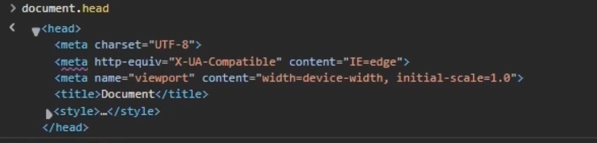

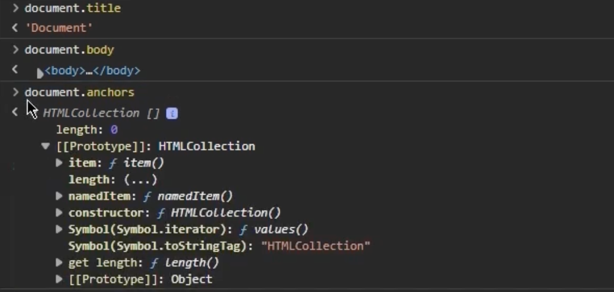

## Documnet.links:

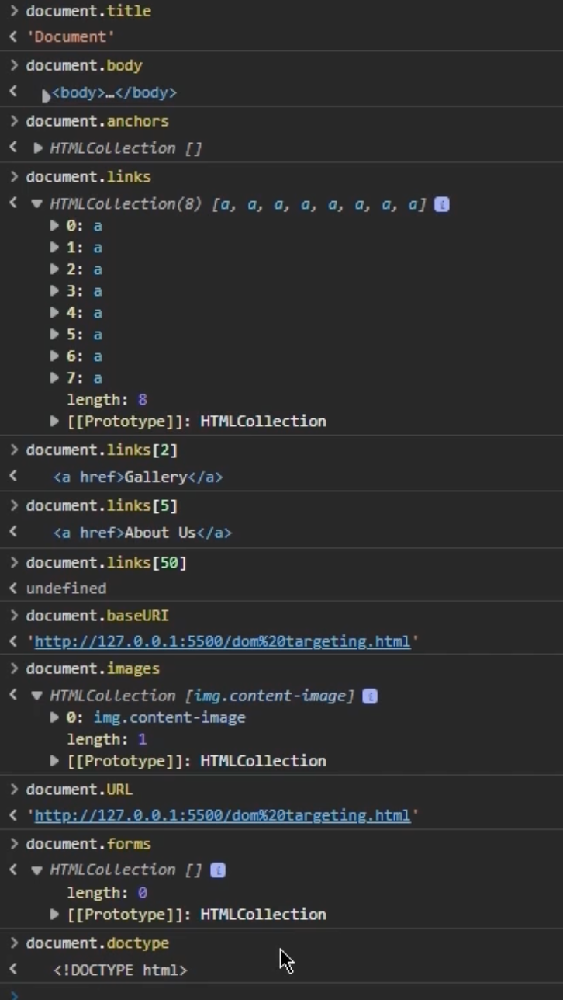

- Trả về một HTMLCollection các phần tử DOM.
- Điều kiện: Chỉ bao gồm các thẻ `<a>` (nchor) và `<area>` có thuộc tính href.Nếu thẻ `<a>` không có href, nó sẽ không nằm trong danh sách này.
- Truy cập: Bạn có thể sử dụng chỉ mục (index) như document.links[0] hoặc duyệt qua bằng vòng lặp

## Document.baseURI:

- Mặc định: document.baseURI mặc định là URL hiện tại của tài liệu, giống với `window.location.href` 0.5.4.
- Thẻ `<base>`: Nếu tài liệu có thẻ `<base>` trong phần `<head>`, `document.baseURI` sẽ trả về giá trị href của thẻ đó thay vì URL hiện tại 0.5.4.
- Sử dụng: Thường dùng để xác định vị trí gốc khi tải các tài nguyên phụ thuộc, đặc biệt là trong các tài liệu SVG hoặc khi xử lý các liên kết tương đối 0.5.4.

## Document.images:

- Kiểu dữ liệu: Trả về một HTMLCollection.
- Truy cập: Có thể truy cập các hình ảnh bằng chỉ số (index) hoặc tên/ID.

## Document.URL:

- là một thuộc tính trả về chuỗi ký tự chứa địa chỉ URL đầy đủ của tài liệu HTML hiện tại

## Documnet.forms:

- `document.forms` là một thuộc tính trả về một HTMLCollection, chứa tất cả các thẻ `<form>` có trong tài liệu hiện tại [1, 2].

## Document.doctype:
- Vị trí: Nó đại diện cho dòng khai báo đầu tiên trong file HTML (ví dụ: `<!DOCTYPE html>`).

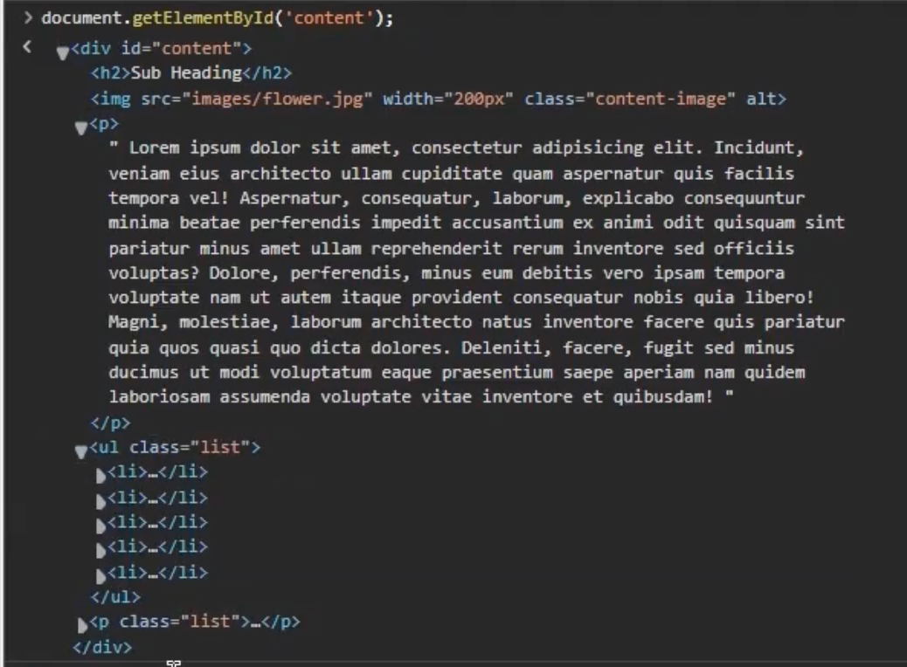

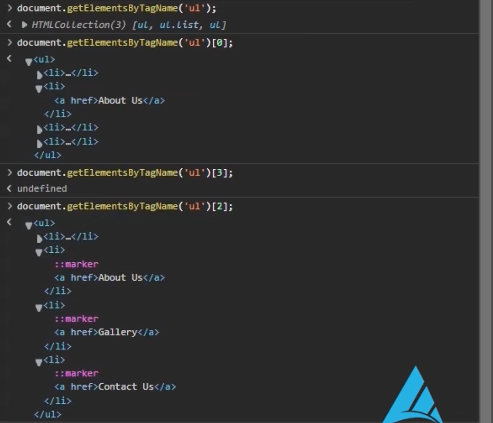

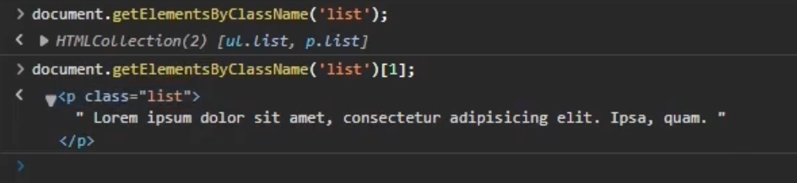

## DOM GET Method:

## DOM styling:

## addEventListener(Events):

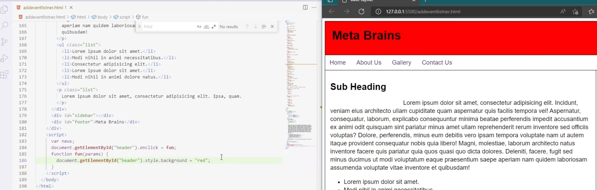

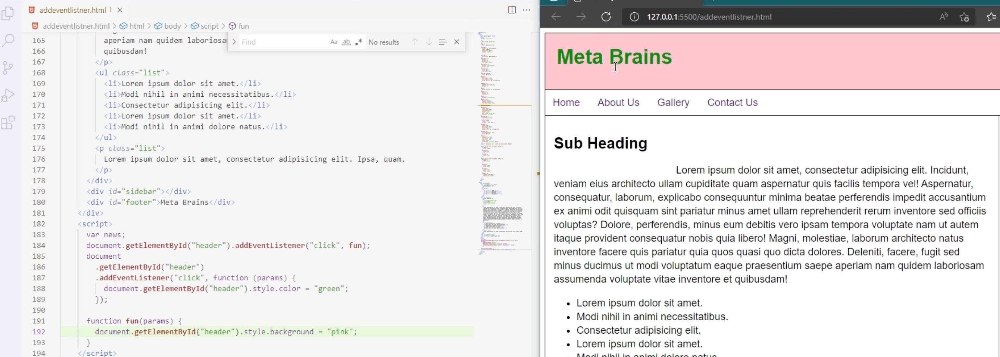

- addEventListener() là phương thức quan trọng nhất trong JavaScript để xử lý các tương tác của người dùng (Events). Nó cho phép bạn thiết lập một hàm sẽ được gọi bất cứ khi nào sự kiện cụ thể xảy ra trên một phần tử.

1. cấu trúc:

      element.addEventListener(event, function, useCapture);

- event: Tên sự kiện (không có chữ "on"), ví dụ: "click", "submit", "mouseover".
- function: Hàm sẽ thực thi khi sự kiện xảy ra.
- useCapture (tùy chọn): Giá trị Boolean (true/false) xác định sự kiện chạy ở giai đoạn "Capturing" hay "Bubbling".

2. Các sự kiện (Events) phổ biến:

- Chuột: click, dblclick, mouseenter, mouseleave.
- Bàn phím: keydown, keyup, keypress.- Form: submit, change, focus, blur.
- Tài liệu/Cửa sổ: DOMContentLoaded, load, resize, scroll.

## USECapture :

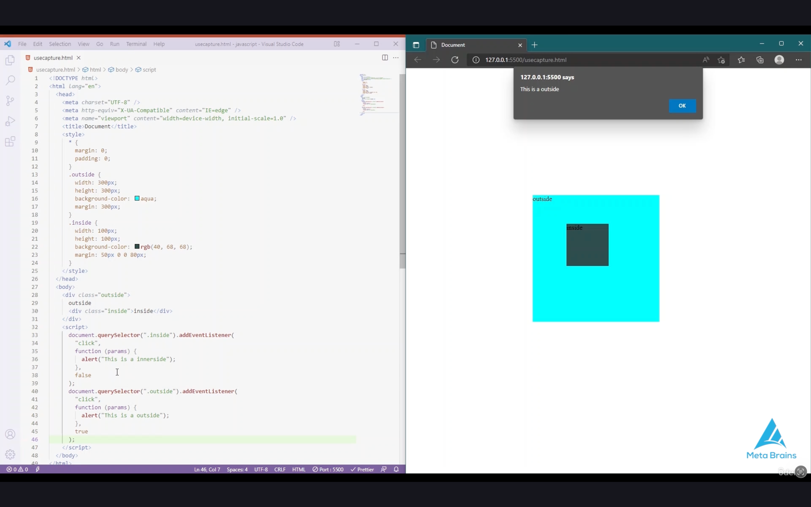

## classList method:
- `classList` trong JavaScript là một thuộc tính read-only trả về một DOMTokenList chứa danh sách các lớp (class) CSS của một phần tử HTML. Nó cung cấp các phương thức tiện lợi như `add()`, `remove()`, `toggle()`, và `contains()` để thao tác trực tiếp với class mà không cần thay thế toàn bộ thuộc tính.

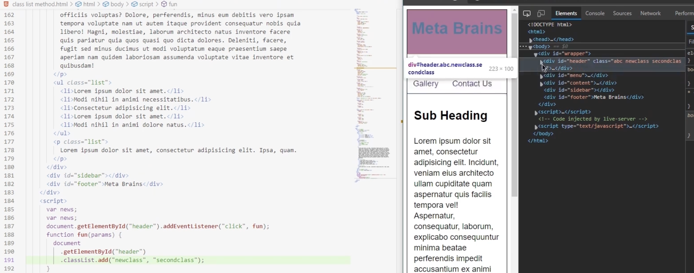

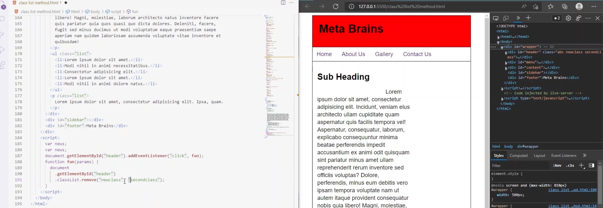

- `classList.length` là một thuộc tính được sử dụng để đếm tổng số lượng CSS class đang được áp dụng trên một phần tử HTML cụ thể.

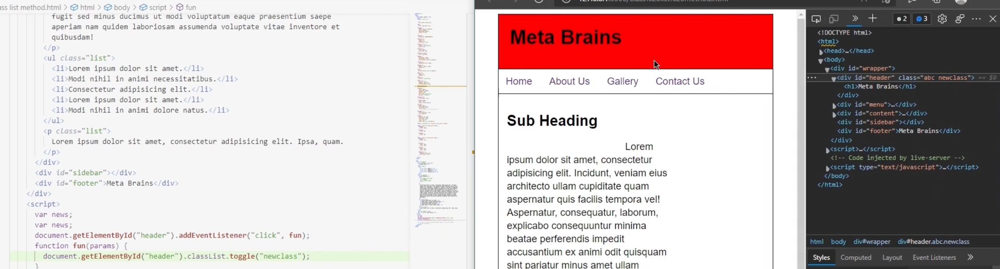

- `classList.toggle` trong JavaScript là một phương thức dùng để thêm hoặc xóa một class CSS trên một phần tử HTML. Nếu class đã tồn tại, nó sẽ xóa đi; nếu chưa có, nó sẽ thêm vào. Đây là cách phổ biến để tạo tương tác như bật/tắt menu, đổi giao diện, hoặc active phần tử.

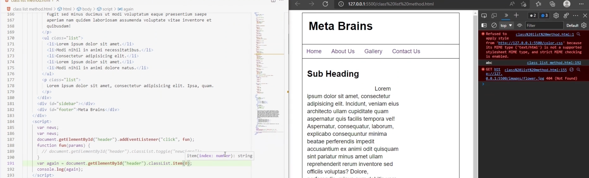

- `classList.item()` trong JavaScript là một phương thức của đối tượng DOMTokenList (được trả về bởi element.classList), dùng để lấy tên class tại một vị trí chỉ mục (index) cụ thể. Phương thức này giúp truy cập class theo thứ tự xuất hiện, bắt đầu từ (0).

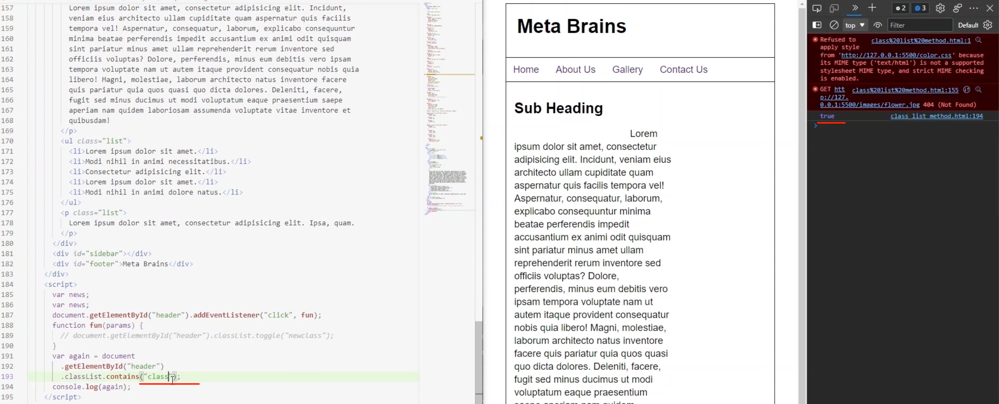

- `classList.contains()` trong JavaScript là một phương thức được sử dụng để kiểm tra xem một phần tử HTML có sở hữu một lớp CSS (class) cụ thể hay không. Nó trả về giá trị boolean: true nếu class tồn tại và false nếu không, rất hữu ích cho các câu lệnh điều kiện (if/else) để thay đổi giao diện.

## Parent Nodes: (**tất cả đều là Read-only**)

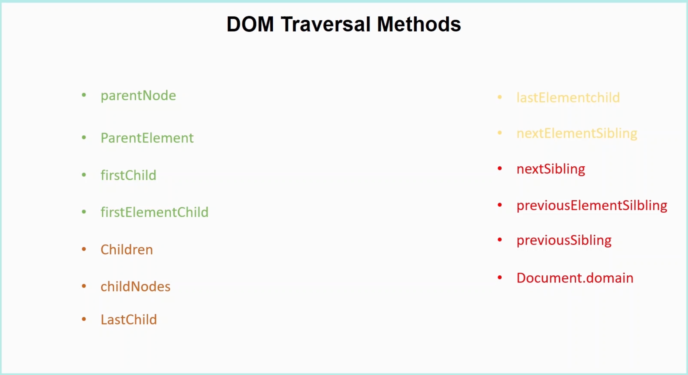

- `.parentElement` trong JavaScript dùng để lấy phần tử HTML cha (node cha là Element) của một phần tử được chỉ định. Nó trả về null nếu nút đó không có cha hoặc cha không phải là một phần tử HTML.

- `.children` trả về tập hợp các phần tử con trực tiếp (HTML elements) của một phần tử cha. Khác với childNodes, children chỉ bao gồm các node là phần tử (tags) và bỏ qua các node văn bản (text nodes) hoặc khoảng trắng.

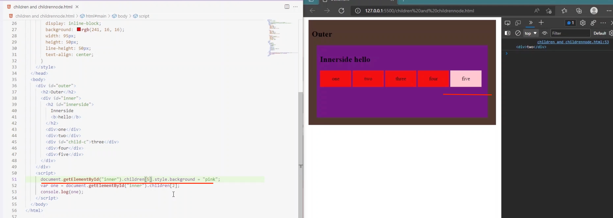

    

       <h2 id="innerside">Innerside</h2>
       
one

    

Nếu bạn dùng hai lệnh này trên thẻ `#inner`:

- `.document.getElementById("inner").children` : Trả về 2 phần tử (h2 và div)
- `.document.getElementById("inner").childNodes` : Trả về 5 hoặc nhiều hơn các node (bao gồm thẻ h2, thẻ div, và các khoảng trắng xuống hàng giữa chúng).

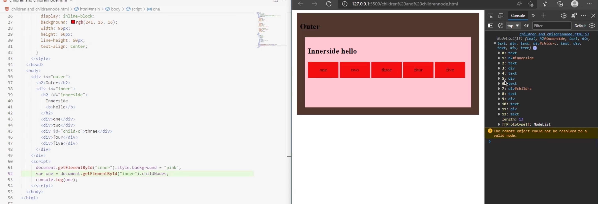

## First and last child:

1. `firstElementChild` trong JavaScript là thuộc tính chỉ đọc (read-only), được dùng để lấy phần tử con đầu tiên (Element node) của một phần tử DOM được chỉ định. Nó bỏ qua các node văn bản (text node) hoặc khoảng trắng, chỉ trả về phần tử HTML thực sự, hoặc null nếu phần tử đó không có con.

 Các đặc điểm chính:

- Chỉ Element: Không giống như firstChild (trả về node bất kỳ, bao gồm cả text/comment), firstElementChild chỉ trả về phần tử HTML node (thẻ HTML).
- Giá trị trả về: Một đối tượng Element hoặc null nếu không có phần tử con.
- Sử dụng: Thường dùng để duyệt DOM, lấy phần tử con đầu tiên để thay đổi style, nội dung

    
    
     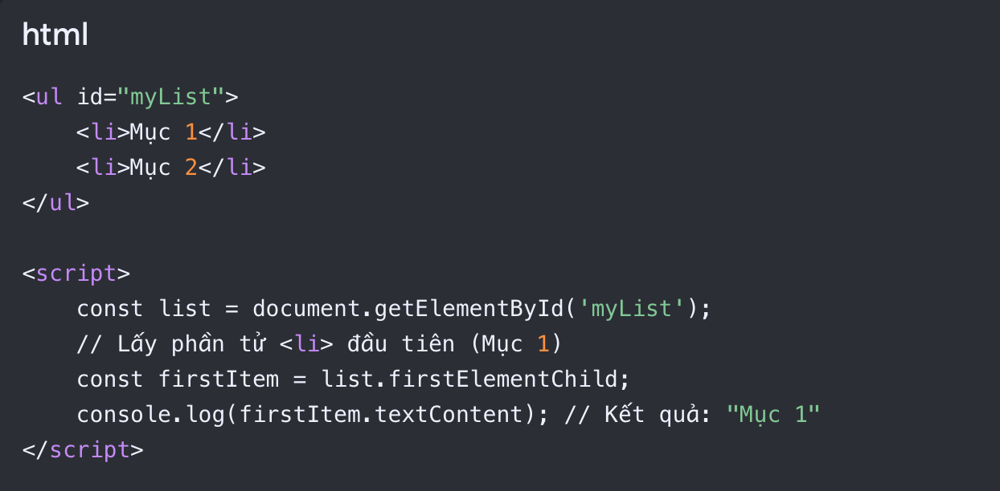

2. `.lastElementChild` trong JavaScript là thuộc tính chỉ đọc (read-only) dùng để truy cập phần tử con cuối cùng của một nút DOM, nhưng chỉ trả về các phần tử HTML (element nodes). Nó bỏ qua các nút văn bản (text nodes), khoảng trắng, hoặc comment, giúp bạn tập trung thao tác trực tiếp trên các thẻ HTML con.

Đặc điểm chính

- Giá trị trả về: Một đối tượng Element (thẻ HTML) cuối cùng hoặc null nếu không có phần tử con nào.
- Sự khác biệt: Khác với `.lastChild` (có thể trả về text node/khoảng trắng), `.lastElementChild` chỉ trả về phần tử HTML thực sự

- `.previousElementSibling` trong JavaScript là một thuộc tính chỉ đọc (read-only) dùng để lấy phần tử (Element) ngay trước phần tử hiện tại trong cùng một cấp cha. Nếu không có phần tử đứng trước (tức là nó là phần tử đầu tiên hoặc chỉ có text/comment node đứng trước), nó sẽ trả về null.
 
 Đặc điểm chính:
 
 - Chỉ chọn Element: Khác với `.previousSibling` (trả về bất kỳ node nào bao gồm cả khoảng trắng/text), `.previousElementSibling` chỉ trả về thẻ HTML (Element node).
 - Giá trị: Trả về đối tượng Element hoặc null.
 - Ứng dụng: Thường dùng để duyệt DOM, tìm thẻ đứng trước ví dụ như tìm label trước input, hoặc li trước li hiện tại.

 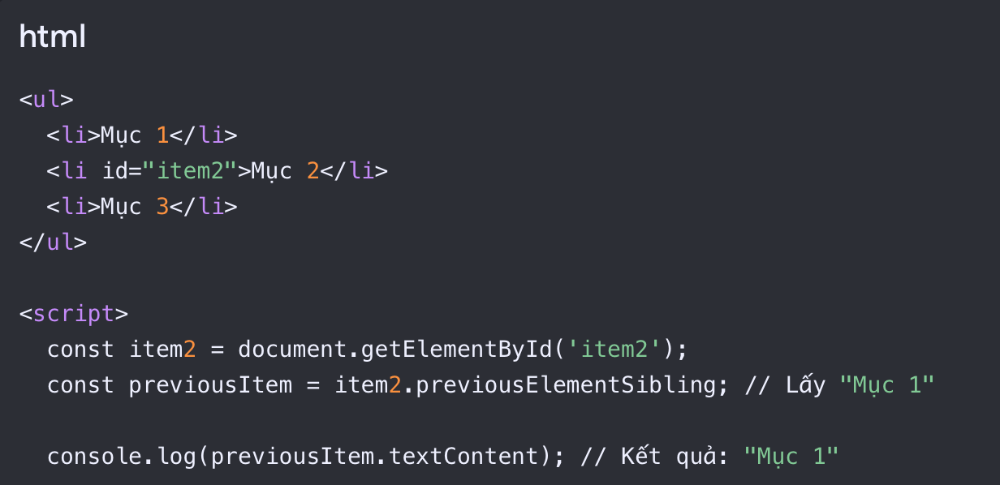

Thuộc tính `.nextElementSibling` trong JavaScript được sử dụng để truy cập phần tử (Element) tiếp theo cùng cấp (anh em) với phần tử hiện tại trong cây DOM.

Đặc điểm chính:

- Chỉ đọc (Read-only): Bạn chỉ có thể lấy giá trị, không thể gán lại bằng thuộc tính này.
- Trả về Element: Trả về đối tượng Element tiếp theo.
- Bỏ qua Text/Comment Nodes: Khác với `.nextSibling` (có thể trả về khoảng trắng hoặc comment), `.nextElementSibling` chỉ trả về các thẻ HTML.
- Trả về null: Nếu phần tử hiện tại là phần tử cuối cùng trong cha của nó, nó sẽ trả về null.

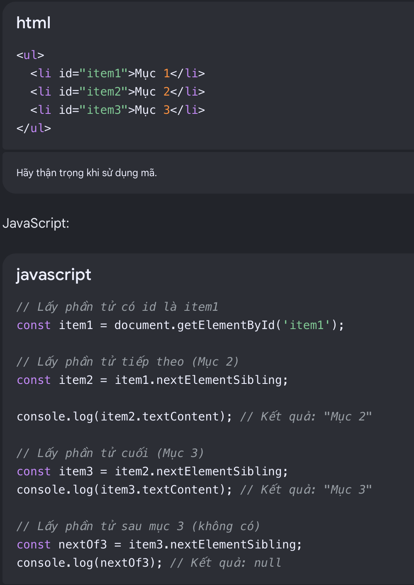

## Create element text nodes:

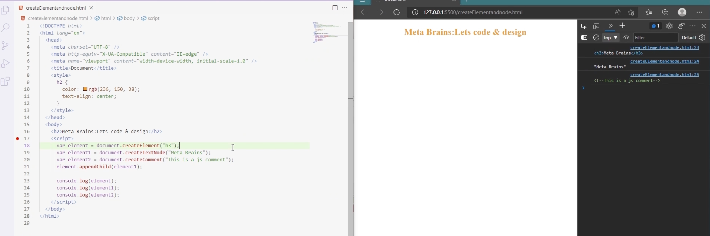

## Append child and insret before:

1. `.appendChild()` trong JavaScript là phương thức dùng để thêm một nút (node) con mới vào cuối danh sách các nút con của một nút cha xác định. Nó thường được kết hợp với `document.createElement()` để tạo và chèn các phần tử HTML mới vào trang web, trả về chính nút vừa được thêm vào.

Cách sử dụng `.appendChild()`:

- Chọn phần tử cha: Nơi bạn muốn chèn nút mới.
- Tạo nút mới: Dùng `document.createElement()`.
- Thêm nút: Dùng `parentElement.appendChild(newElement)`

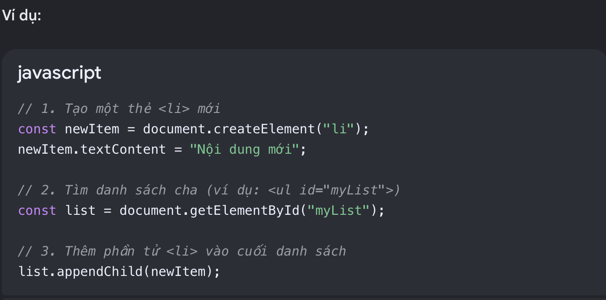

Các đặc điểm quan trọng:

- Chèn vào cuối: Phần tử luôn được thêm vào vị trí cuối cùng trong danh sách con của phần tử cha.
- Di chuyển nút: Nếu nút được thêm đã tồn tại trong tài liệu, `appendChild()` sẽ tách nó khỏi vị trí cũ và di chuyển nó đến vị trí mới (không tạo bản sao).
- Giá trị trả về: Trả về nút mới được thêm.

Khác biệt giữa `appendChild()` và `append()`:

- `appendChild()`: Chỉ nhận một nút (node) và trả về nút đó 
- `.append()`: Có thể nhận nhiều nút hoặc chuỗi (strings) và không trả về giá trị (undefined).

2. `.insertBefore()` trong JavaScript là phương thức dùng để chèn một node (phần tử) mới vào ngay trước một node con đã tồn tại bên trong một node cha. Đây là công cụ quan trọng trong thao tác DOM để thêm hoặc di chuyển các phần tử HTML

       parentNode.insertBefore(newNode, referenceNode);

Các tham số:

- newNode: Nút (phần tử) mới muốn chèn vào.
- referenceNode: Nút con hiện tại, nút mới sẽ được đặt ngay trước nó.
- parentNode: Nút cha quản lý nút tham chiếu

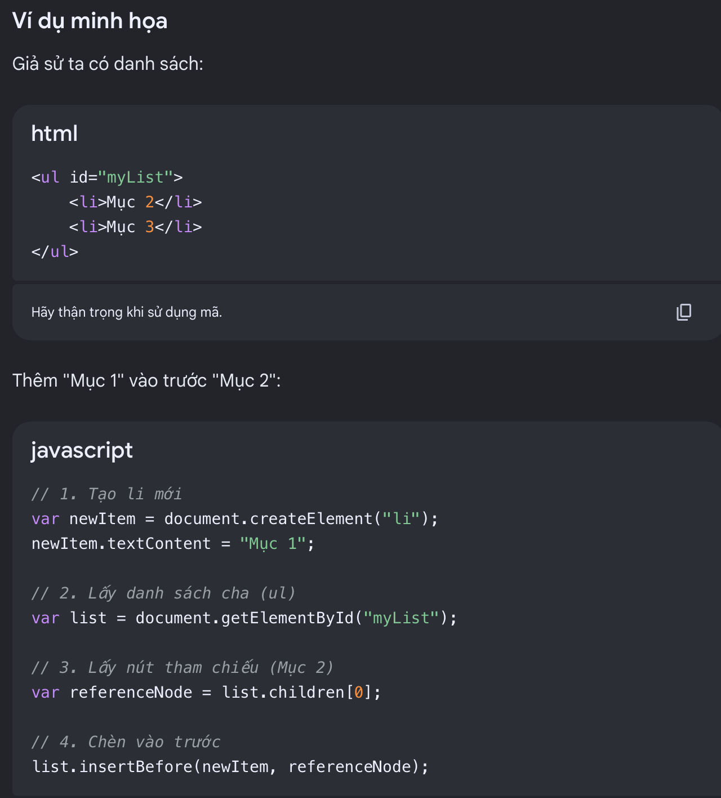

## Insert adjacent element and adjacent html:

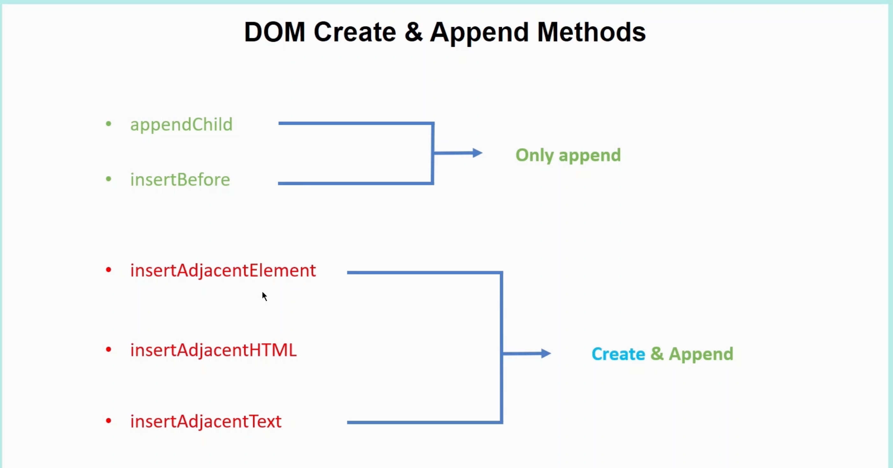

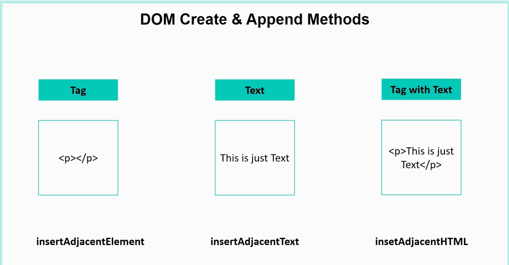

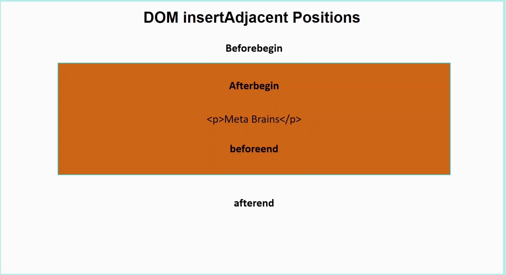

ví dụ:

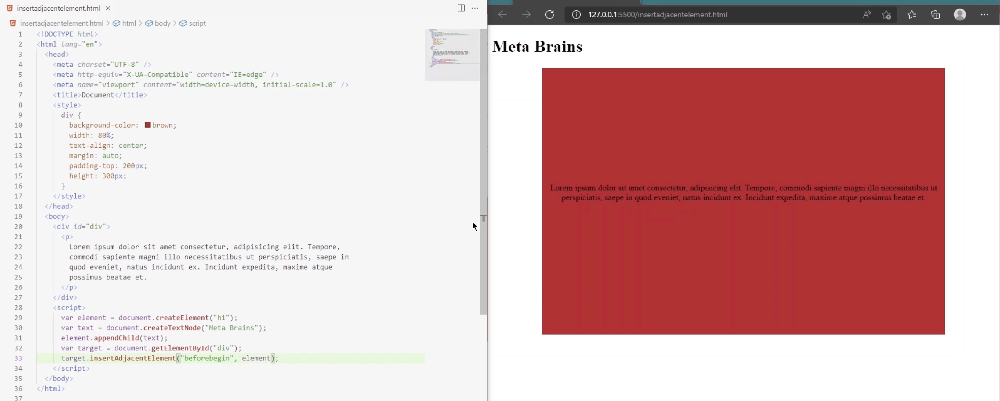

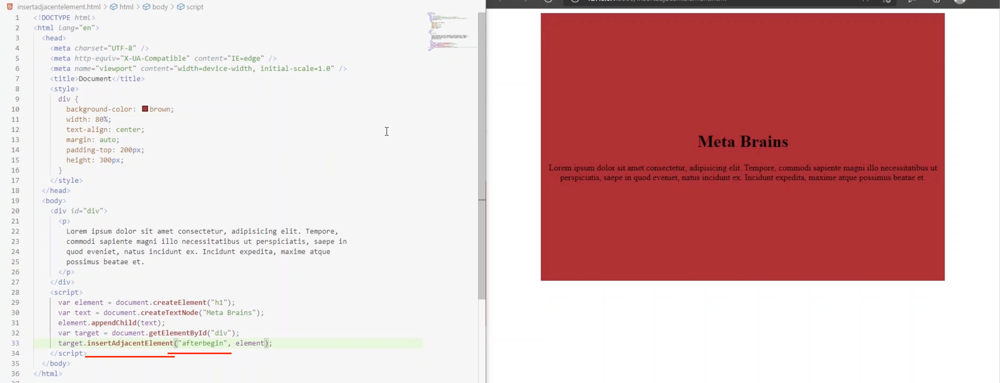

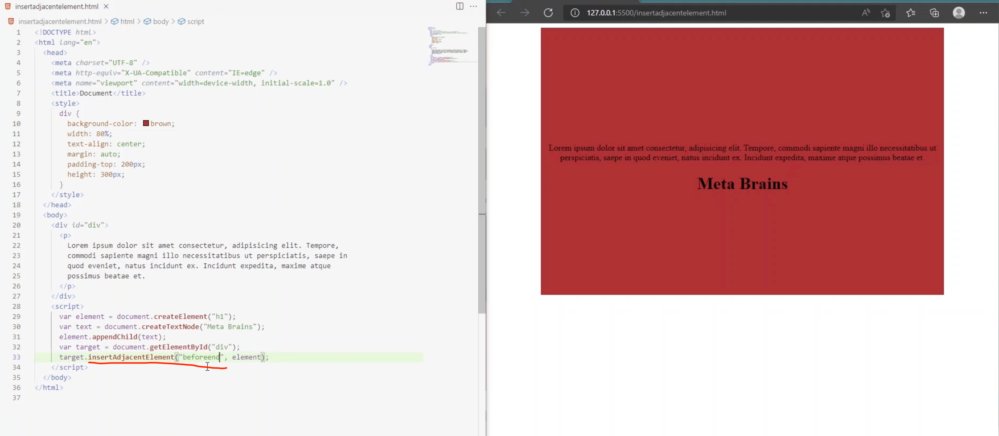

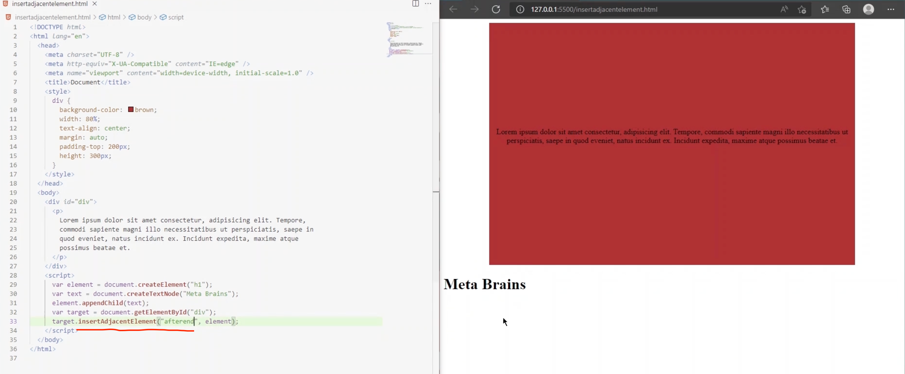

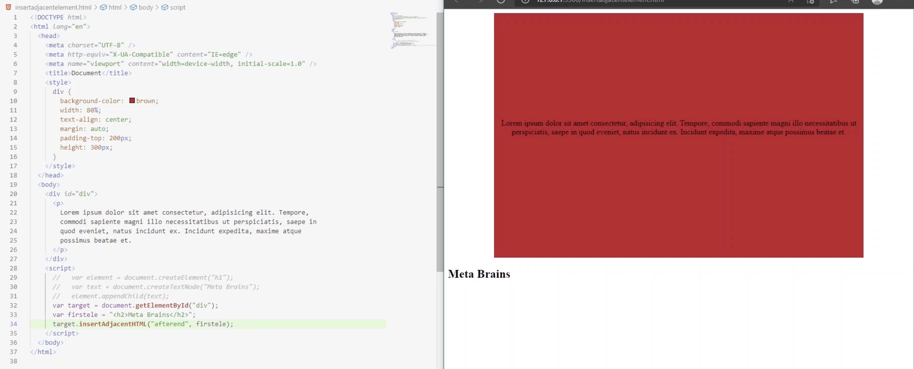

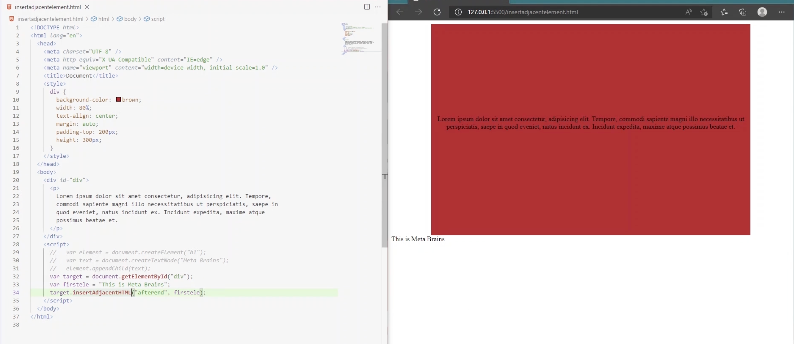

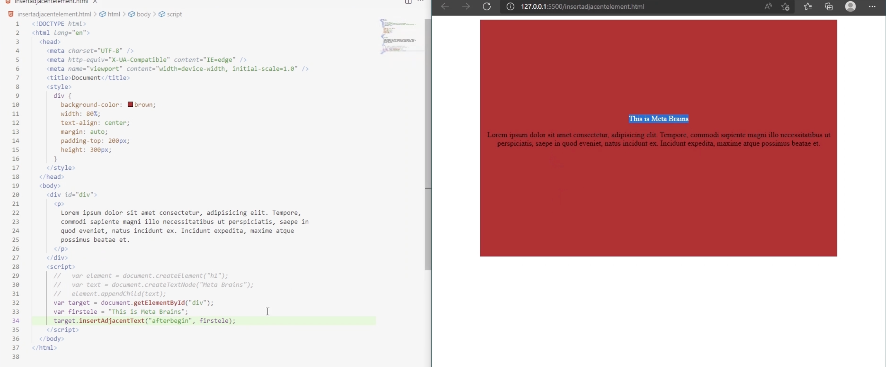