# 1. Function

# 2. What is an object ?

lưu trữ dữ liệu hoặc tạo 1 biến : 
     
     let .... = ..... 
lưu nhiều : 

     let .... = {
       ..... <=== object
       .....
     } 

ex:

## 2.1 document:

# 3.What is an Arrays?

- tập hợp 1 hay nhiều phân tử

- `push` chỉ là phần tích hợp sẵn của ngôn ngữ JS mà các mảng tự động có quyền truy cập

## 3.1 Muốn thêm vào dải:

## 3.2 Muốn xoá:

- trong JS bắt đầu bằng số 0( số bên trái)
- số lượng muốn xoá từ mảng ( số bên phải) 

## 3.3 Muốn viết hoa tất cả cách chữ cái trong tên :

=>>TOM

## 3.4.Làm tròn số: 

=>> 8

## 3.5 Để tra cứu 1 mục trong 1 mảng bằng chỉ số của nó

=>> 8

==> dog

# 4. Making decisions:

## 4.1 if/else:

## 4.2 while:

### 4.2.1 Mỗi câu nằm trên 1 dòng riêng:

# 5.High order function:

## a higher-order function is a function that either:
- Accepts a function as an argument

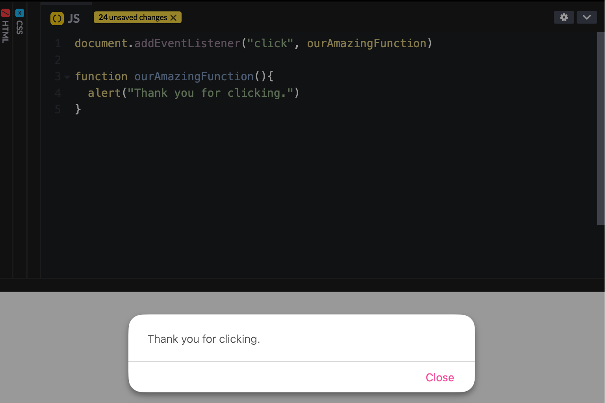

## Create an ex function that rreturn a function:

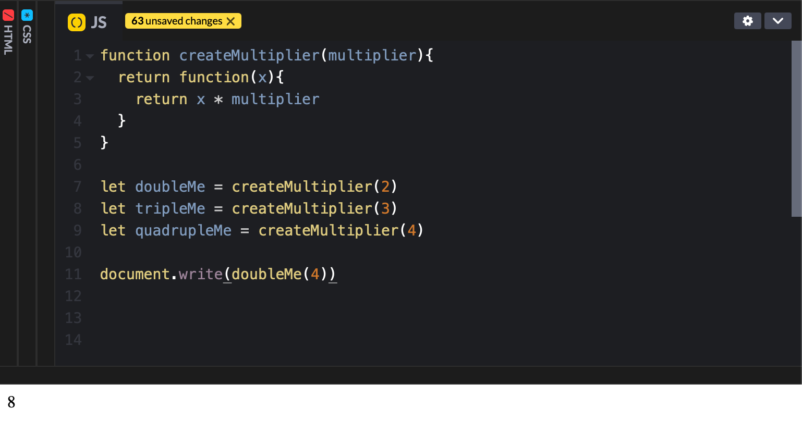

## useful higher-order functions that are part of the language itself (and not just web browser jargon)

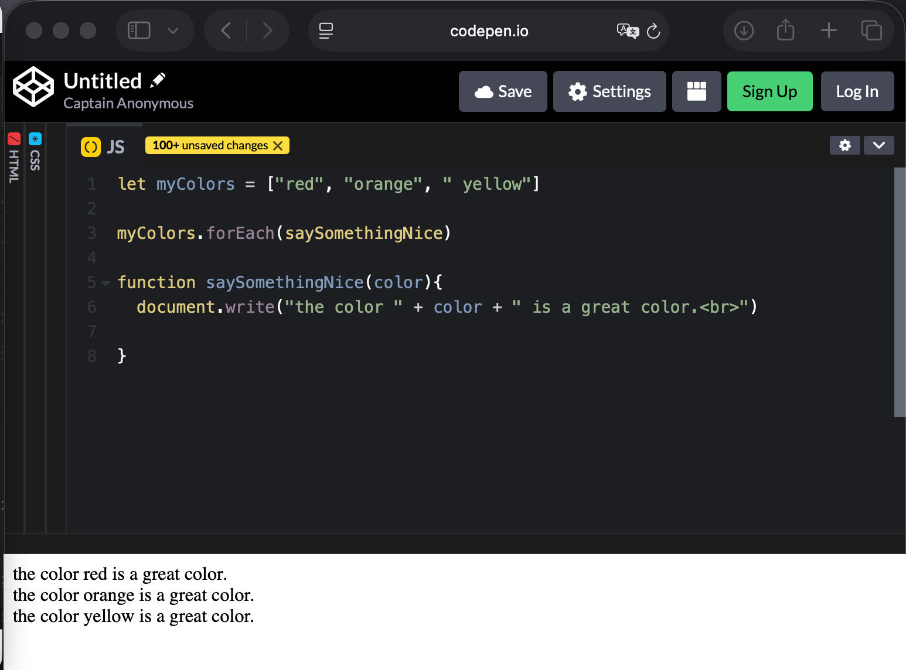

# 6. Returning(trả về) and Mutating(thay đổi):

## 6.1 Mutating:

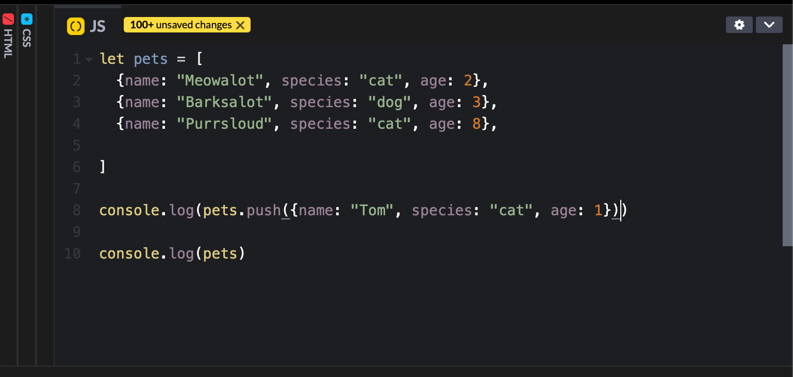

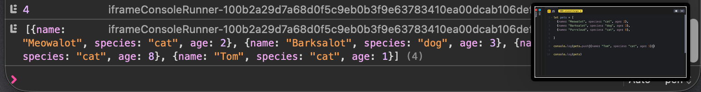

## 6.2 Return:

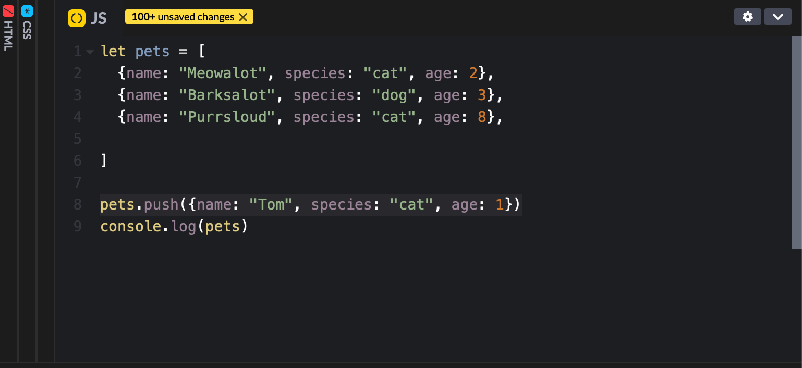

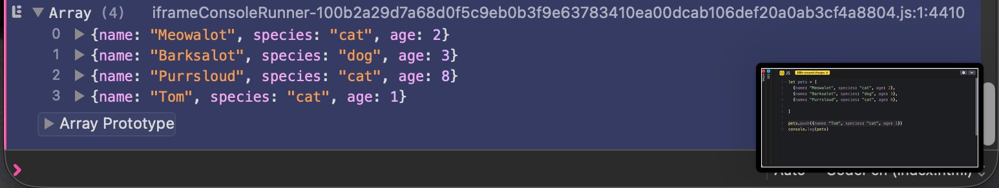

## 6.3 Arr.map()

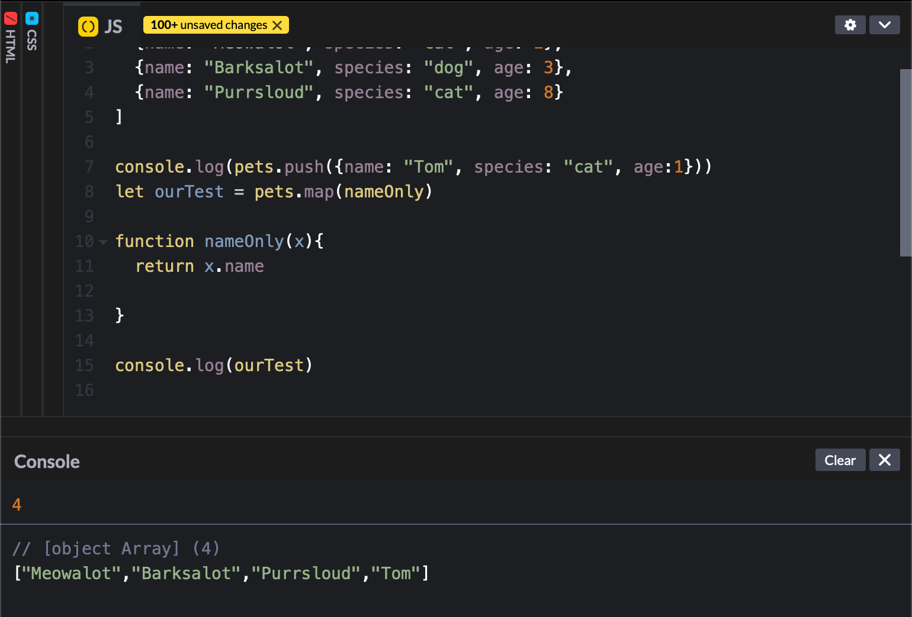

## 6.4 Arr.filter()

Ex1:

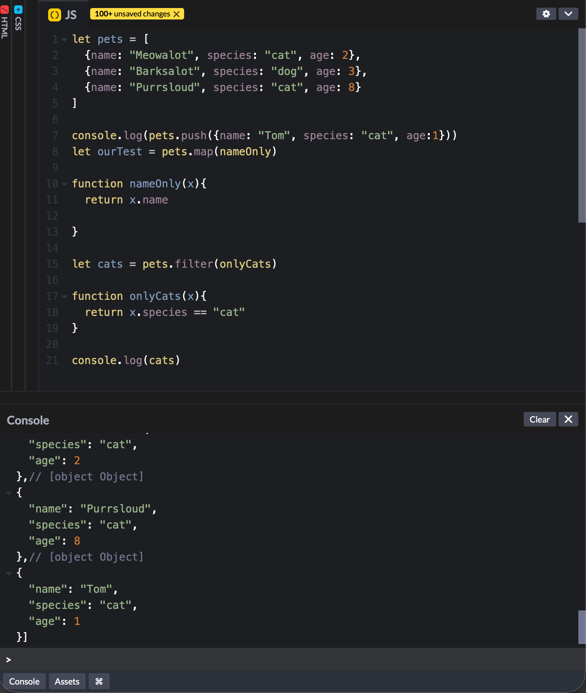

Ex2:

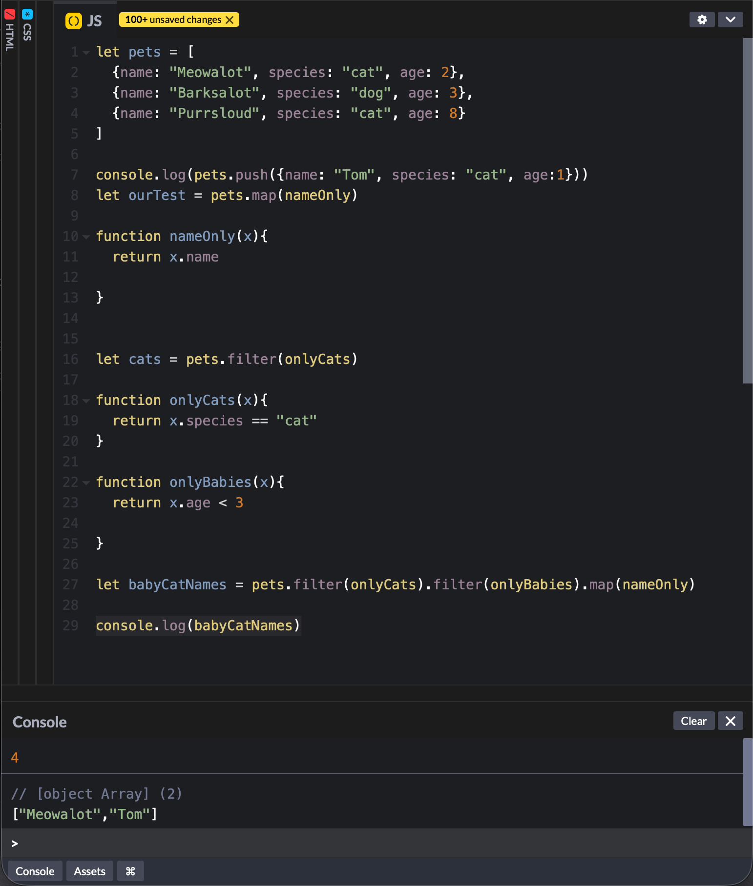

# 7. Scope and Context:

## Scope:

- để trong block thì ko truy cập được ngoài block

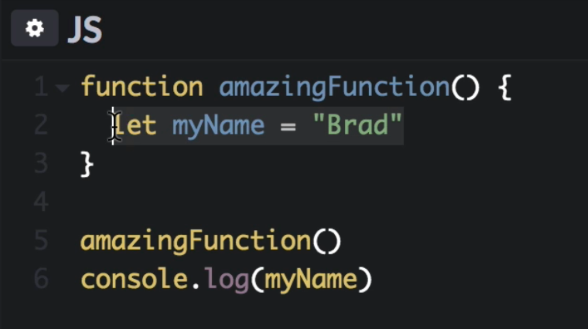

* Code có thể ra ngoài truy cập 1 biến, nhưng nó không vào trong được (đường 1 chiều). 

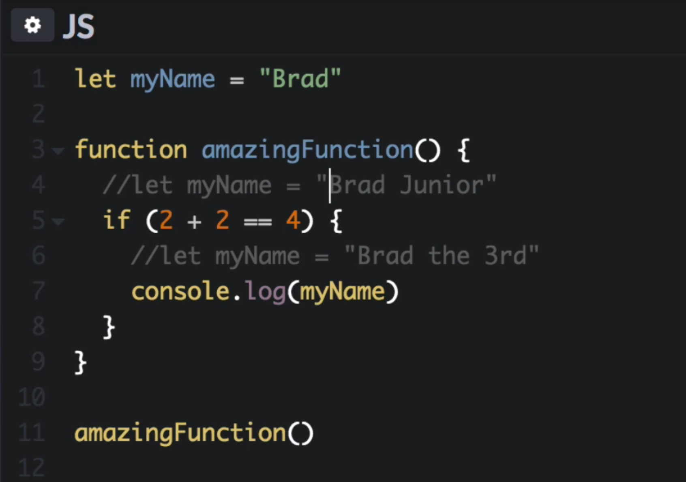

- Code di chuyển lên từng cấp đến khi tìm được.

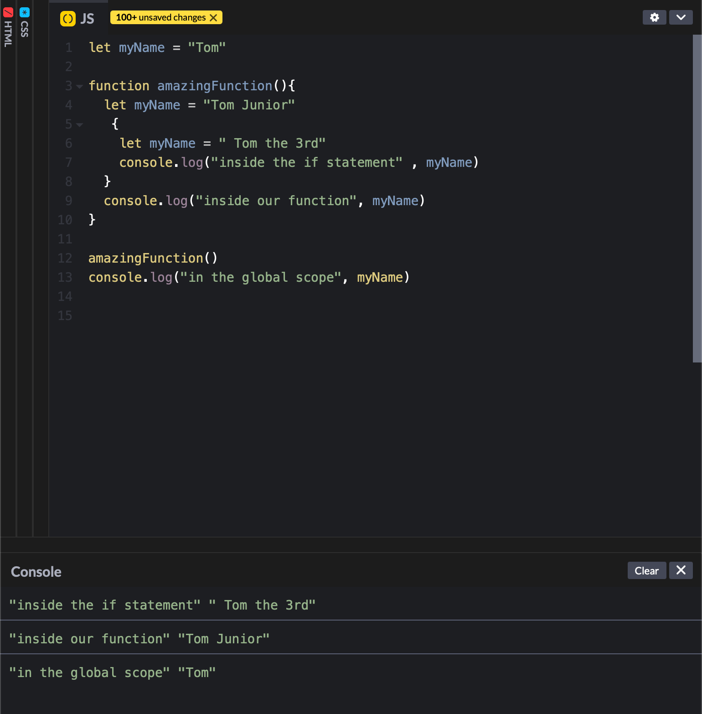