# 1. Selector:

## 1.1 Element:
- The element selector selects HTML elements based on the element name.

## 1.2 Class:

Class trong CSS (lớp) là bộ chọn (selector) dùng để định kiểu (style) cho một hoặc nhiều phần tử HTML cụ thể có cùng thuộc tính lớp. Class được khai báo bằng dấu chấm (.) theo sau là tên lớp. Nó cho phép tái sử dụng định dạng trên nhiều phần tử, giúp mã HTML/CSS gọn nhẹ, dễ bảo trì và tối ưu hóa quy trình thiết kế giao diện web. 

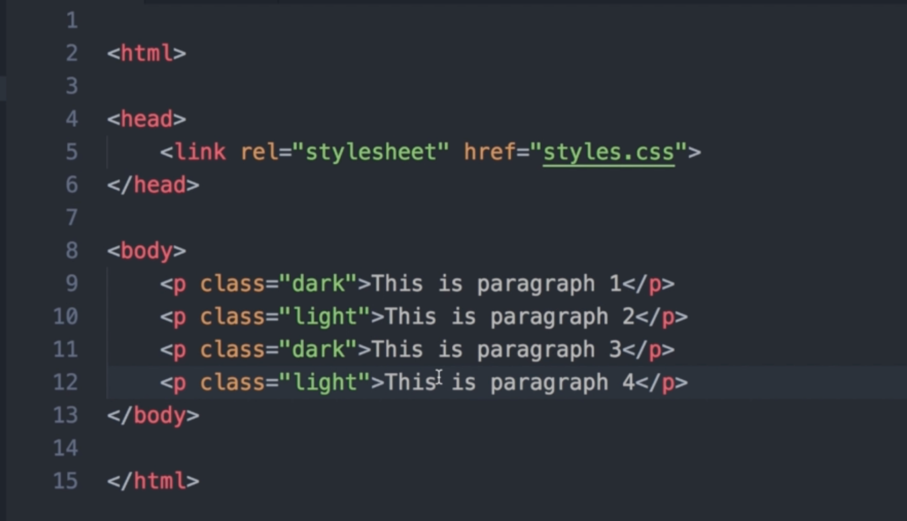

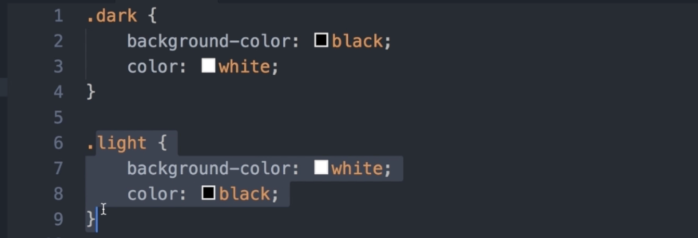

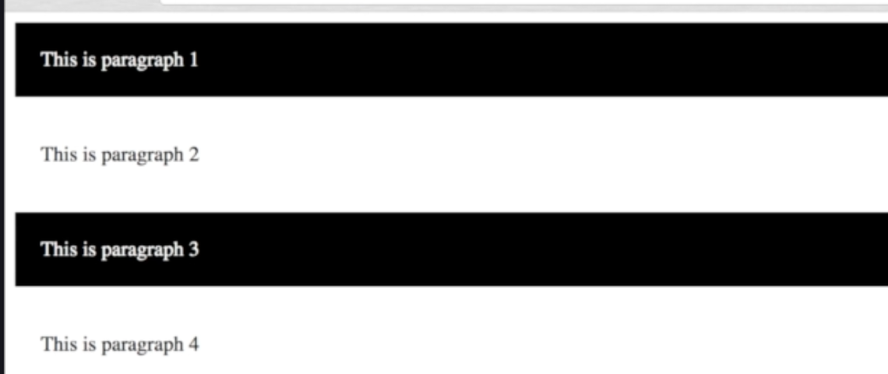

## 1.3 ID

ID trong CSS (định danh) được dùng để định kiểu cho một phần tử HTML duy nhất trên trang web. ID sử dụng dấu thăng `(#)` theo sau là tên ID để chọn phần tử. Mỗi trang chỉ nên có một phần tử mang ID đó, có độ ưu tiên cao cao nhất trong CSS, thường dùng cho các thành phần độc nhất như `#header`, `#footer`

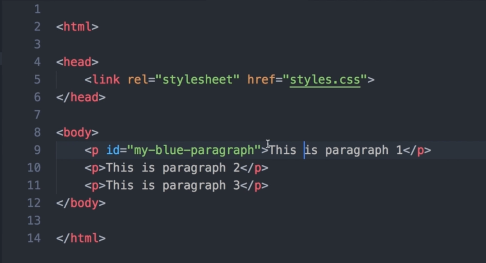

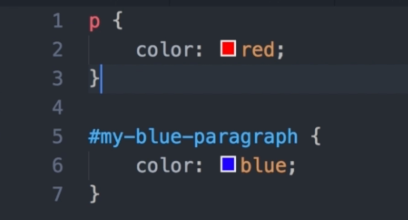

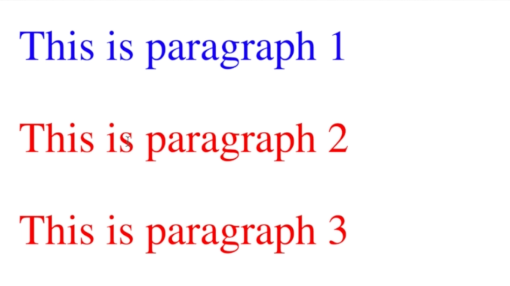

# 2. Color:

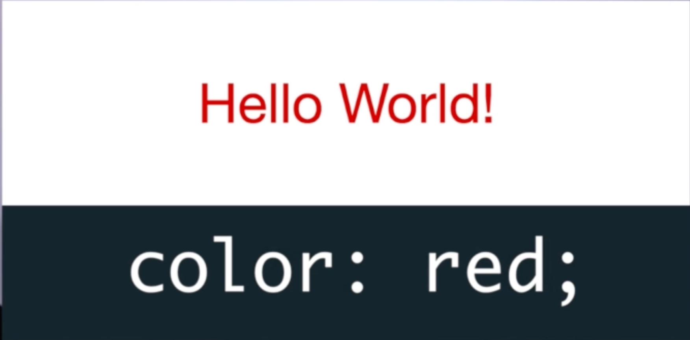

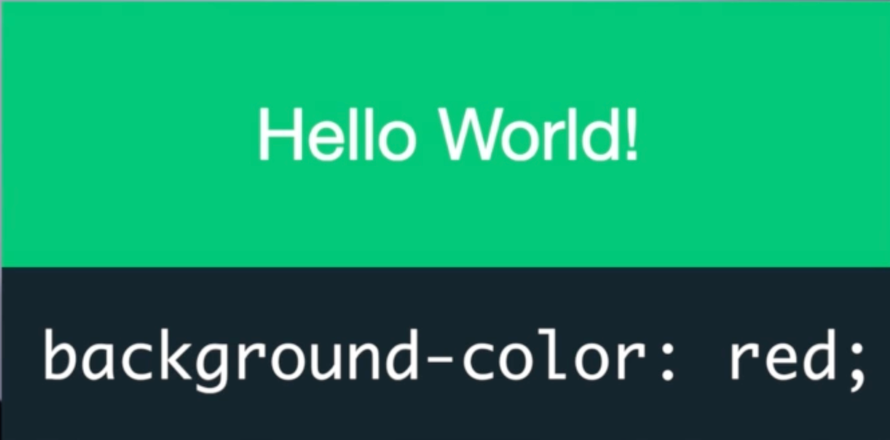

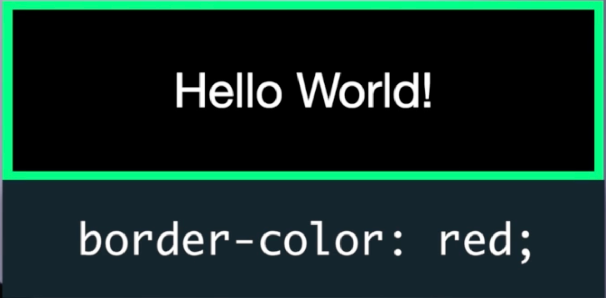

## 2.1 Muốn nhạt hơn:

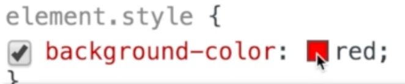

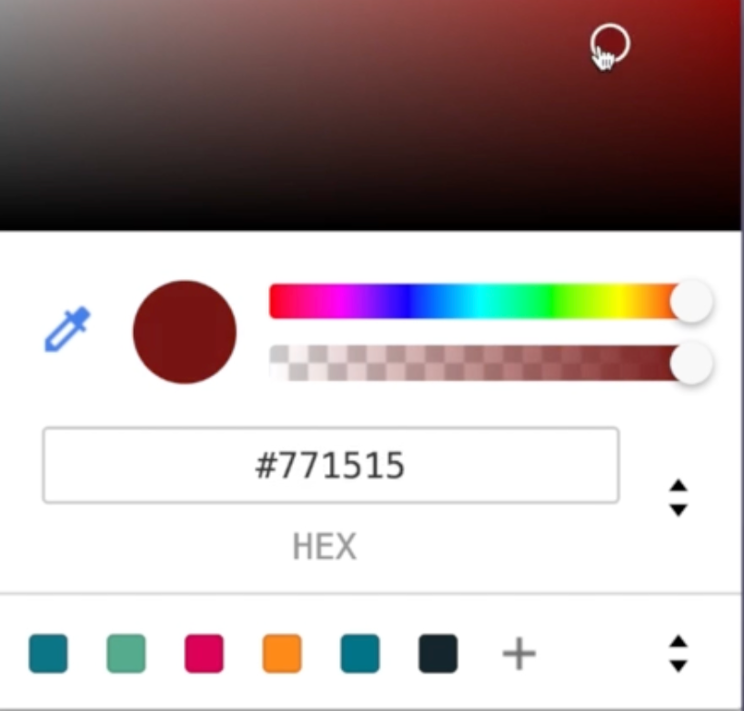

## 2.2 Hex values:

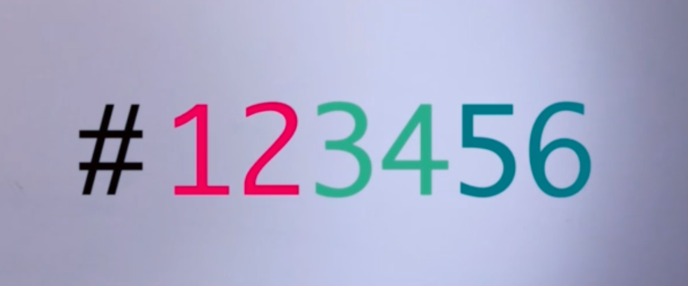

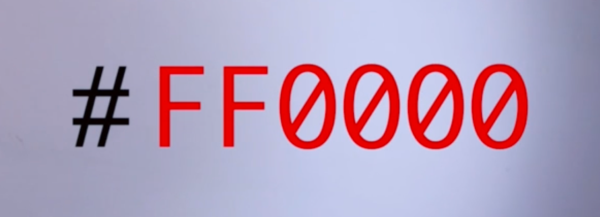

## 2.3 RGB values:

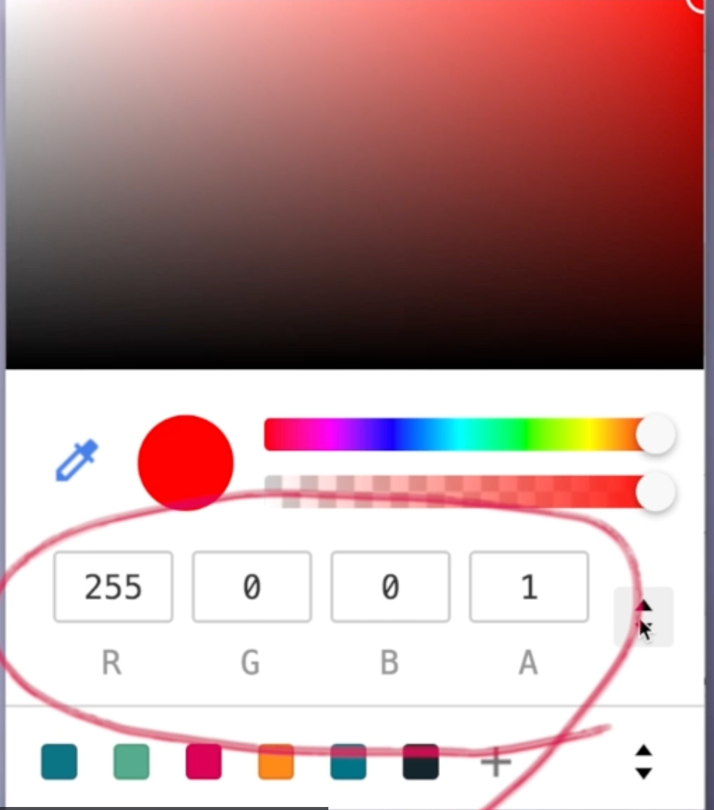

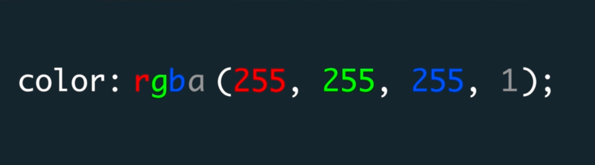

- That's red, green, blue, alpha.
- The Alpha Channel is the transparency level of your color or opacity level.
- Meaning how much can you see through it 
- By default, all colors are 100 percent visible.
- There's you can't see through them.
- So they're alpha value is one.
- It goes from zero to one.

Ex:

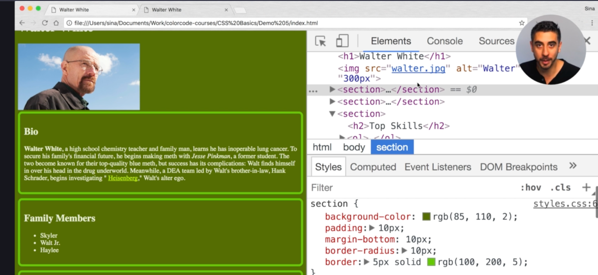

# 3. Sizing:

## 3.1 Pixel(Absolute):

- Pixel is what's called an absolute unit, meaning it doesn't depend on anything.

## 3.2 Percentage(relative):

- they kind of just adjust to their containing parent elements.

## 3.3 EM (relative):

- `em` is mostly used to size text size.
- Your font is absolutely crucial in having a good looking page.
- It's one of the most important aspects of UI design typography.
- `em` is another relative unit of measurement similar to percentage.
- `em` always has a number of upgrades. Like `2em`, `3em`, `0.5em`

- Font size `2em` means If I didn't have any access, I want my size to be twice as big.
- Font size is usually inherited from the parents.

## 3.4 REM (relative):

-  `REM` is exactly the same as `EM` except it's not relative to the inherited font size from the parent.
- It's relative to the root element to your beloved HTML tag.

 
NOTE: **If no font size here, but the browser will actually act as if the HTML element has a font size 16 pixels on it.**

# 4. Box model:

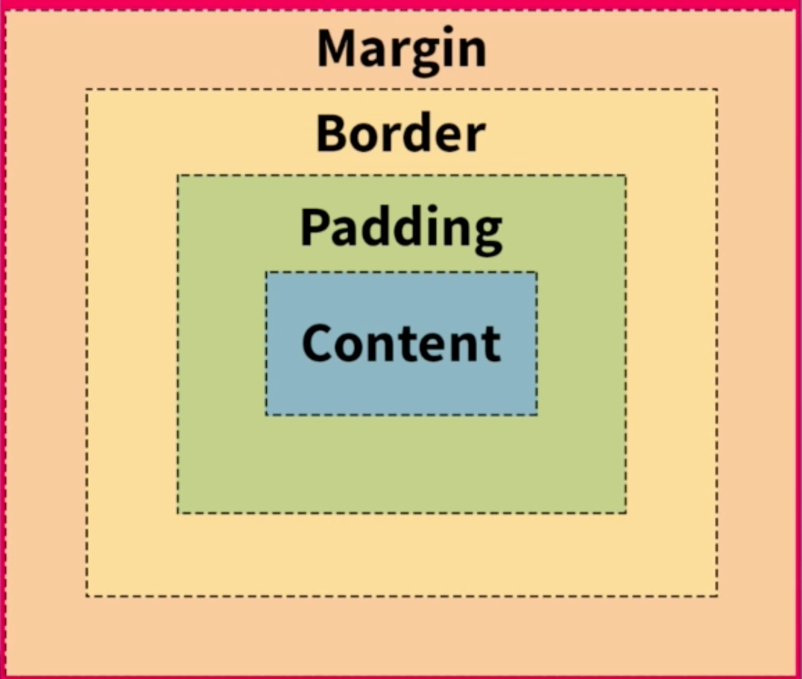

## 4.1 Content:

- What you see inside the box in the context of a paragraph content is the text itself, in the case of our sections, in our profile.
- The children are the content.
- That's the visible part.

## 4.2 Padding:

- `Padding` is the space between the content and the edges of the box.

- `padding-top`, `padding-right`, `padding-bottom` and `padding-left`.

## 4.3 Border:

- The border of your element by default is zero pixels.

## 4.4 Margin:

- `Margin` is the space around the visible part of the elements outside the borders.
- Margins are what allowing neighbouring elements to be laid out next to each other without bumping into one another.
- And the way you change margin is very similar to padding.
- `margin-top`, `margin-right`, `margin-bottom` and `margin-left`.

# 5. Fonts:

https://fonts.google.com

tài liệu thanm khảo:

https://www-w3schools-com.translate.goog/css/default.asp?_x_tr_sl=en&_x_tr_tl=vi&_x_tr_hl=vi&_x_tr_pto=tc
