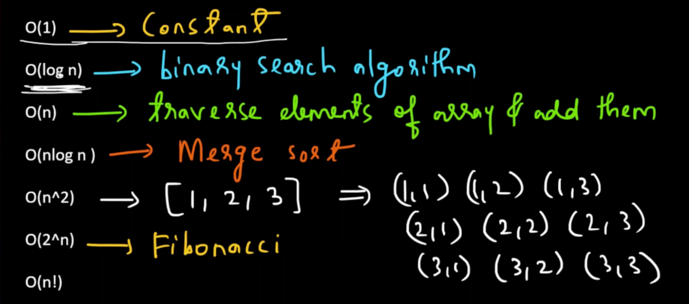
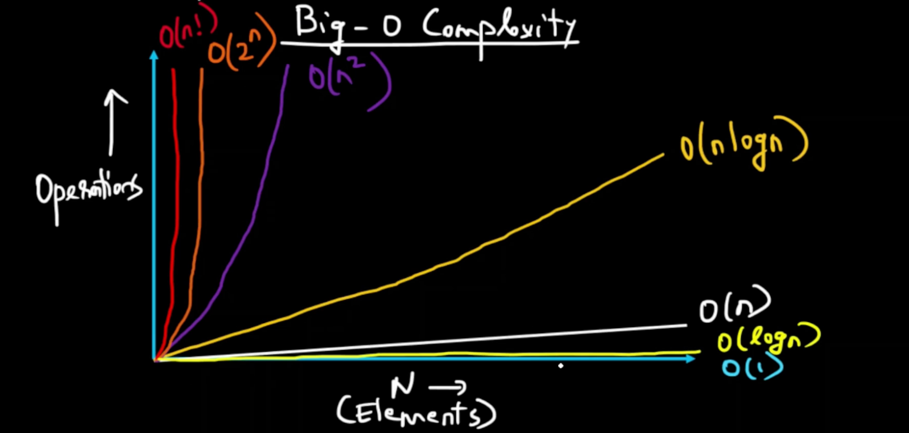
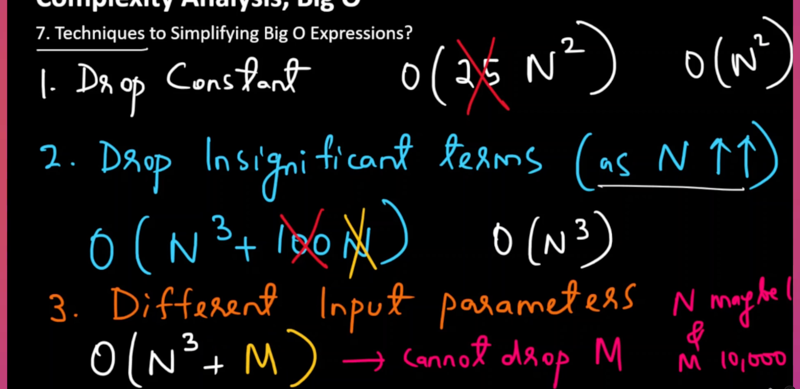

# Big O:

Có hai loại độ phức tạp là Time Complexity và Space Complexity.

- **Time Complexity (Độ phức tạp thời gian)** :sẽ thể hiện thời gian chạy của một chương trình sẽ thay đổi như thế nào khi kích thước của đầu vào thay đổi.
- **Space Complexity (Độ phức tạp bộ nhớ)** :thể hiện lượng bộ nhớ mà thuật toán sử dụng khi kích thước đầu vào thay đổi. Cũng giống như Time Complexity, Space Complexity là một yếu tố quan trọng cần được cân nhắc, đặc biệt là trong các hệ thống hạn chế về tài nguyên bộ nhớ.




- Ký hiệu Big-O mô tả hành vi giới hạn của một hàm khi Lập luận có xu hướng hướng tới một giá trị cụ thể hoặc vô hạn.Vì vậy, đó là những gì chúng ta đã thấy trong trường hợp phân tích tiệm cận.Vì vậy, khi n trở nên rất lớn hoặc có xu hướng về vô hạn, chúng ta đang cố gắng tìm ra hàm sốTrở nên bằng tiệm cận.Và chúng tôi đang sử dụng ký hiệu Big-O để thể hiện điều đó.

- Ở đây ký hiệu Big-O được sử dụng để phân loại các thuật toán theo yêu cầu về thời gian chạy hoặc không gian của chúng ,phát triển khi kích thước đầu vào tăng lên.Vì vậy, đây là những gì chúng ta đã nói về độ phức tạp thời gian.Và chúng ta sẽ sử dụng ký hiệu O lớn để phân loại thuật toán cho phù hợp.

- O (Big O notation) là một cách để mô tả độ phức tạp của một thuật toán, đặc biệt là thời gian và không gian cần thiết khi kích thước dữ liệu đầu vào tăng lên.

  - O(1): Thời gian hằng số, không phụ thuộc vào kích thước dữ liệu.
  - O(n): Thời gian tuyến tính, tăng lên theo kích thước dữ liệu.
  - O(n log n): Thời gian tăng trưởng nhanh hơn, thường gặp trong các thuật toán sắp xếp như merge sort hay quicksort.




- Cách hiểu O trong Big O Notation:

  - “O” trong Big O biểu thị "Order" (thứ tự), nói về tốc độ tăng trưởng của thuật toán. Nó cho biết mức độ tối đa mà thời gian hoặc không gian sẽ tăng khi kích thước đầu vào tăng.



# Recursion:

-  Recursion (Đệ quy) đơn giản là việc một hàm tự gọi chính nó cho đến khi đạt đến điều kiện cơ sở hoặc điều kiện kết thúc.

## When to use ?

- Nếu bạn cần giải quyết một vấn đề và nhận thấy rằng vấn đề đó có thể được chia thành các bài toán con nhỏ hơn, đồng thời việc giải quyết các bài toán con này giúp giải quyết được vấn đề ban đầu, thì có lẽ bạn nên sử dụng đệ quy.
- Trong nhiều trường hợp, các bài toán con này thường có cùng bản chất hoặc tương tự như chính vấn đề ban đầu.

## Basic

Để hình dung về đệ quy, người ta thường sử dụng hai công cụ đắc lực: cây đệ quy (recursion tree) và ngăn xếp lời gọi đệ quy (recursion call stack).

1. Cây đệ quy:

Cây đệ quy thể hiện cấu trúc các lời gọi đệ quy của một hàm. Mỗi nút trong cây đại diện cho một lời gọi hàm, và các nhánh đại diện cho các lời gọi đệ quy tiếp theo.

Ví dụ: Khi tính giai thừa (n!) bằng hàm đệ quy:
- Bắt đầu với 5!, dẫn đến phép tính 5 * 4!
- Quá trình này tiếp diễn cho đến khi đạt đến trường hợp cơ sở (thường là 1!), tạo thành cấu trúc cây trong đó:
   - Gốc cây là lời gọi ban đầu (ví dụ: f(5)).
   - Các lời gọi tiếp theo (ví dụ: f(4), f(3), v.v.) phân nhánh từ đó cho đến khi chạm tới trường hợp cơ sở f(1).

Việc hiểu cách các lời gọi hàm được phân tách giúp ích rất nhiều trong các buổi phỏng vấn lập trình cũng như khi đánh giá độ phức tạp về thời gian và không gian.

2. Ngăn xếp lời gọi đệ quy:

Bên cạnh cây đệ quy, việc hình dung ngăn xếp lời gọi đệ quy giúp làm rõ luồng thực thi của chương trình. Mỗi lời gọi hàm được đưa vào ngăn xếp, và khi đạt đến trường hợp cơ sở, ngăn xếp bắt đầu quá trình giải phóng (unwind):
- Ngăn xếp lưu trữ các biến cục bộ và địa chỉ trả về cho mỗi lời gọi hàm.
- Sau khi trường hợp cơ sở trả về kết quả, quyền điều khiển quay lại lời gọi trước đó để thực hiện các thao tác còn lại (ví dụ: in giá trị trong quá trình quay ngược trở lên).

Nắm vững các công cụ này sẽ giúp bạn viết và gỡ lỗi (debug) các hàm đệ quy dễ dàng hơn.


## recursive leap of faith.

- Khái niệm "bước nhảy niềm tin đệ quy" đóng vai trò then chốt trong việc sử dụng đệ quy hiệu quả để giải quyết vấn đề. Dưới đây là tóm tắt về nội dung của khái niệm này:

   - Hiểu rõ vấn đề: Trước tiên, hãy xác định rõ ràng vấn đề cần giải quyết. Đó có thể là bất cứ việc gì, từ tính giai thừa cho đến tạo ra các dãy số.
   - Xác định các bài toán con: Chia nhỏ bài toán chính thành các bài toán con dễ xử lý hơn. Ví dụ, khi tạo một dãy số, bạn có thể cân nhắc cách xây dựng các dãy số nhỏ hơn trước.
   - Tin tưởng vào lời gọi đệ quy: Đây chính là cốt lõi của khái niệm "bước nhảy niềm tin" (leap of faith). Bạn cần tin tưởng rằng hàm đệ quy của mình sẽ giải quyết đúng các bài toán con này. Khi gọi hàm đệ quy, bạn giả định rằng nó sẽ hoạt động chính xác với các trường hợp nhỏ hơn của bài toán; điều này cho phép bạn tập trung vào việc kết hợp các lời giải nhỏ đó thành lời giải cho toàn bộ bài toán.
   - Trường hợp cơ sở (Base case): Xác định trường hợp cơ sở để dừng quá trình đệ quy. Bước này rất quan trọng để ngăn chặn đệ quy vô hạn và đảm bảo hàm của bạn có thể hoàn tất một cách an toàn.
   - Kết hợp kết quả: Sau khi các lời gọi đệ quy trả về kết quả, hãy kết hợp kết quả từ các bài toán con này để tạo thành lời giải cuối cùng.

Khái niệm "bước nhảy niềm tin" nhấn mạnh rằng một khi hàm đệ quy đã được thiết lập đúng, bạn không cần phải nhẩm tính lại từng bước của quá trình đệ quy. Thay vào đó, bạn tin tưởng rằng các trường hợp nhỏ hơn sẽ được xử lý chính xác nhờ vào chiến lược đệ quy mà bạn đã áp dụng. Tư duy này có thể giúp cải thiện đáng kể kỹ năng giải quyết vấn đề của bạn, đặc biệt là trong các buổi phỏng vấn lập trình.

## Recursion vs Iteration

Đệ quy và lặp là những khái niệm cơ bản trong lập trình, đặc biệt là trong lĩnh vực thuật toán. Dưới đây là phần giải thích chi tiết về cả hai:

- Đệ quy(recursive):

   - Định nghĩa: Đệ quy xảy ra khi một hàm tự gọi chính nó để giải quyết một vấn đề. Quá trình này tiếp diễn cho đến khi đạt đến trường hợp cơ sở (base case) hoặc điều kiện dừng.
   - Ví dụ: Chẳng hạn, để in các số từ 1 đến 5, bạn có thể sử dụng một hàm đệ quy thực hiện việc in số hiện tại và sau đó tự gọi lại chính nó với số tiếp theo.
   - Cấu trúc: Đệ quy thường bao gồm trường hợp cơ sở (để dừng việc gọi hàm tiếp theo) và trường hợp đệ quy (khi hàm tự gọi chính nó).
   - Ứng dụng: Đệ quy được sử dụng rộng rãi trong các thuật toán như quay lui (backtracking), quy hoạch động (dynamic programming) và kỹ thuật chia để trị (divide and conquer). Việc hiểu rõ về đệ quy rất quan trọng đối với các buổi phỏng vấn lập trình, vì nhiều câu hỏi phỏng vấn có liên quan đến các khái niệm này.

- Lặp (Iteration):
   - Định nghĩa: Lặp là quá trình thực hiện lại một khối mã (chẳng hạn như vòng lặp) cho đến khi một điều kiện nào đó được thỏa mãn. Quá trình này thường được triển khai bằng các vòng lặp `for` hoặc `while`.
   - Ví dụ: Để thực hiện cùng một tác vụ là in các số từ 1 đến 5, bạn có thể sử dụng một vòng lặp giúp tăng dần giá trị biến đếm sau mỗi lần lặp cho đến khi điều kiện dừng được đáp ứng.
   - Hiệu quả: Nhìn chung, các giải pháp sử dụng vòng lặp có thể tiết kiệm bộ nhớ hơn vì chúng không cần đến không gian ngăn xếp (stack space) như các lời gọi hàm đệ quy – vốn có nguy cơ gây ra lỗi tràn ngăn xếp (stack overflow) khi đệ quy quá sâu.
   - Hiệu năng: Hiệu năng có thể thay đổi tùy thuộc vào từng bài toán cụ thể. Khi đánh giá hiệu quả, điều quan trọng là phải phân tích cả độ phức tạp về thời gian lẫn không gian.

Cả đệ quy và lặp đều có những ưu và nhược điểm riêng; việc lựa chọn phương pháp nào thường phụ thuộc vào bài toán cụ thể và các ràng buộc đi kèm. Việc hiểu rõ khi nào nên áp dụng phương pháp nào có thể ảnh hưởng đáng kể đến hiệu năng cũng như khả năng đọc hiểu mã nguồn của bạn.


## Ways to write Base condition:

Các điều kiện cơ sở đóng vai trò thiết yếu trong đệ quy vì chúng xác định thời điểm hàm đệ quy cần ngừng tự gọi lại chính nó. Dưới đây là một số cách hiệu quả để thiết lập các điều kiện cơ sở:

1. Xác định đầu vào hợp lệ cuối cùng: Hãy xem xét giá trị đầu vào cuối cùng mang lại kết quả hợp lệ. Ví dụ, khi tính giai thừa của một số ( n ), điều kiện cơ sở có thể là khi ( n ) bằng 1. Tại thời điểm này, hàm sẽ trả về 1 vì ( 1! = 1 ).

2.  Xác định đầu vào không hợp lệ đầu tiên: Một cách khác là xem xét giá trị đầu vào đầu tiên không tạo ra kết quả hợp lệ. Trong ví dụ về giai thừa, khi ( n ) bằng 0, ( 0! ) được định nghĩa là 1; đây chính là điểm dừng cho quá trình đệ quy.

3. Kết hợp cả hai khái niệm: Trong một số trường hợp, hai phương pháp này có thể được sử dụng thay thế cho nhau, tuy nhiên tùy vào cách triển khai cụ thể mà phương pháp này có thể thuận tiện hơn phương pháp kia.

## the recurrence relation: 

- Hệ thức truy hồi là biểu thức biểu diễn nghiệm của một bài toán dưới dạng hàm số của các nghiệm cho những trường hợp nhỏ hơn của cùng bài toán đó.

# Backtracking

- Quay lui (backtracking) là một phương pháp thuật toán dùng để tìm lời giải cho các bài toán có nhiều hướng đi khả thi.
- Các lời giải được xây dựng từng bước một thông qua cơ chế đệ quy.
- Nếu một hướng đi không dẫn đến lời giải do vi phạm các ràng buộc, thì hướng đi đó sẽ bị loại bỏ.

## how backtracking is different from simple recursion.

- Đệ quy đơn thuần là việc một hàm tự gọi chính nó cho đến khi đạt đến điều kiện cơ sở hoặc điều kiện kết thúc.
- Quay lui (backtracking) là một dạng đệ quy có kiểm soát. Trong quay lui, trạng thái của bài toán được thay đổi trực tiếp ngay tại chỗ.
- Đệ quy có kiểm soát nghĩa là bất cứ khi nào xác định được một hướng đi không dẫn đến lời giải, ta sẽ loại bỏ (cắt tỉa) hoặc từ bỏ hướng đi đó.

## How does backtracking work?

- Biểu diễn bài toán: Thuật toán quay lui (backtracking) được áp dụng cho các bài toán mà ta có thể xây dựng dần các ứng viên cho lời giải, đồng thời loại bỏ những ứng viên đó khi xác định rằng chúng không thể dẫn đến một lời giải hợp lệ.
- Khám phá đệ quy: Thuật toán này tận dụng triệt để cơ chế đệ quy. Nó khám phá từng phương án một, phát triển dựa trên trạng thái hiện tại cho đến khi tìm thấy lời giải tiềm năng hoặc xác định rằng hướng đi đó không khả thi.
- Loại bỏ hướng đi: Nếu trong quá trình khám phá, một hướng đi vi phạm bất kỳ ràng buộc nào của bài toán, thuật toán sẽ thực hiện quay lui (tức là quay lại các bước trước đó). Nó sẽ hủy bỏ lựa chọn gần nhất và thử phương án khả dụng tiếp theo.
- Đệ quy có kiểm soát: Phương pháp này thường được mô tả là "đệ quy có kiểm soát", trong đó trạng thái của bài toán được thay đổi trực tiếp (in-place). Hàm đệ quy thường có một điều kiện cơ sở để kiểm tra xem đã tìm thấy lời giải hay chưa (ví dụ: tất cả các ô trong bảng Sudoku đã được điền đúng).
- Xây dựng từng bước: Lời giải được xây dựng từng bước một; nếu tìm thấy lời giải hoàn chỉnh, nó sẽ được trả về; nếu không khả thi, hàm sẽ quay lui và thử một hướng đi khác.

Ví dụ, hãy xem xét bài toán giải Sudoku. Mỗi khi điền một số, bạn cần kiểm tra xem nó có vi phạm quy tắc Sudoku hay không. Nếu có, bạn sẽ quay lui và thử số tiếp theo.

Nhìn chung, quay lui giúp giảm độ phức tạp một cách hiệu quả bằng cách loại bỏ sớm các hướng đi chắc chắn sẽ thất bại, thay vì phải khám phá chúng đến cùng.

## blueprint which you can use to solve any backtracking coding interview question.

Để tạo một kế hoạch chi tiết có cấu trúc nhằm giải quyết các vấn đề quay lui, bạn có thể làm theo khung mã giả này:
1. Định nghĩa hàm: Xác định hàm trợ giúp sẽ quản lý quá trình quay lui.

```
function backtrack(state) {
    // Base case
    if (isSolution(state)) {
        saveSolution(state);
        return;
    }

    // Recursive case
    for (let option of options(state)) {
        makeChoice(state, option);      // Modify the state
        backtrack(state);               // Recursion
        undoChoice(state, option);      // Backtrack
    }
}
```

2. Điều kiện cơ sở: Xác định thời điểm trạng thái hiện tại của bài toán tạo thành một lời giải hoàn chỉnh. Việc này có thể bao gồm kiểm tra xem tất cả các vị trí cần thiết đã được điền đúng hay chưa (ví dụ: trong trò chơi Sudoku).
3. Khám phá các lựa chọn: Duyệt qua tất cả các lựa chọn khả thi tại trạng thái hiện tại. Ví dụ: điền một số vào ô trống trong Sudoku hoặc chọn một phần tử trong bài toán tổ hợp.
4. Thay đổi trạng thái: Cập nhật trạng thái để phản ánh lựa chọn hiện tại. Bước này cho phép xây dựng lời giải tiềm năng tiếp theo.
5. Đệ quy và Quay lui: Gọi hàm hỗ trợ theo phương thức đệ quy. Nếu một lựa chọn dẫn đến vi phạm ràng buộc, hãy hủy bỏ lựa chọn đó (quay lui) và thử một lựa chọn khác.
6. Lặp lại cho đến khi hoàn tất: Tiếp tục quy trình này cho đến khi đã thử tất cả các cấu hình hoặc tìm được lời giải hợp lệ.

Đối với những dạng bài tập này, kỹ thuật quay lui (backtracking) rất hữu ích, nhưng nó không phù hợp để giải quyết các bài toán tối ưu hóa.
Nếu bạn cần tìm giá trị tốt nhất, lớn nhất, nhỏ nhất hoặc cực đại của một đại lượng nào đó, thì nhiều khả năng bài toán đó đòi hỏi phải sử dụng quy hoạch động thay vì quay lui.