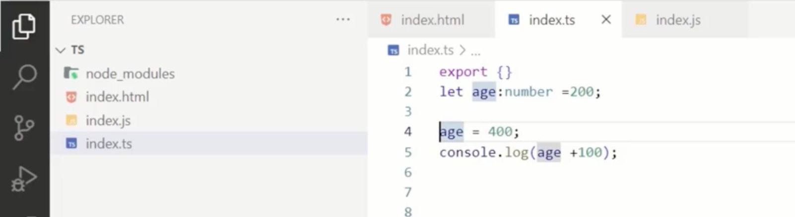
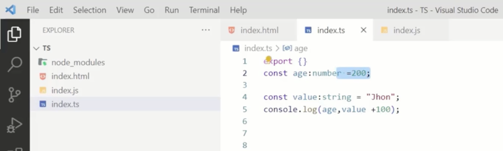
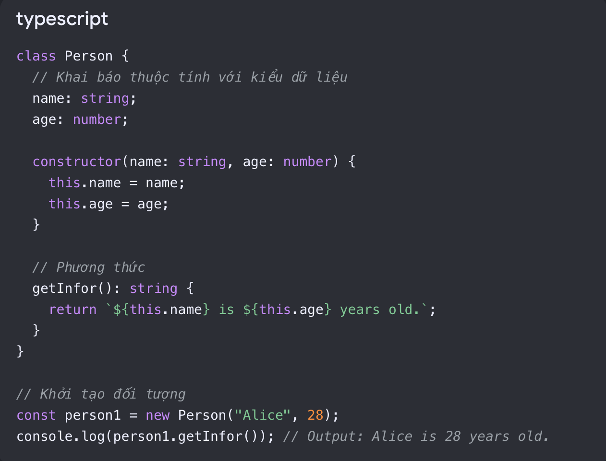

# Typescript

- TypeScript requires compilation into JavaScript before it can run in the browser

# Basic:

## Variable:

- with `let`, we cannot redeclare a variable with the same name.

- The second type of variable is `const`, and it comes with several restrictions. You cannot assign values to a const variable multiple times or redeclare it.

## Datatypes:( String, number, boolean, null, object, arrays, undefined)

## Classes:

- `Classes` are a fundamental concept that allows you to define blueprints for creating objects with specific properties.

- `Classes` provide a way to create reusable, organized and structured code.

- The `This` keyword is used when you want to reference a value from the class.

- `Constructors` are special methods within a `class ` executed when an object is created. They are used for object initialization and any necessary setup.

- This demonstrates how we can use classes and constructors to initialize objects, and it's coded in TypeScript.

# Advanced:

- `inheritance` allows one class to inherit the properties and methods of another class. If a class has specific properties and methods defined in it, another class can utilize those properties from the first class without the need to redefine them.

