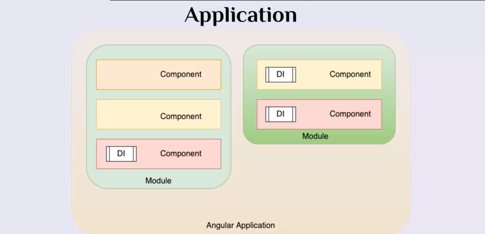
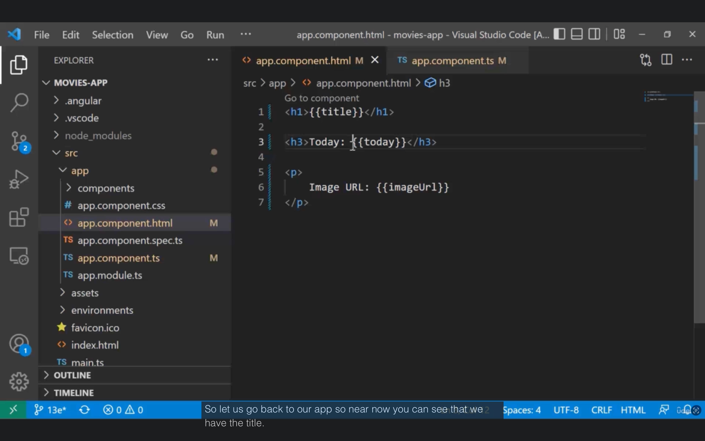
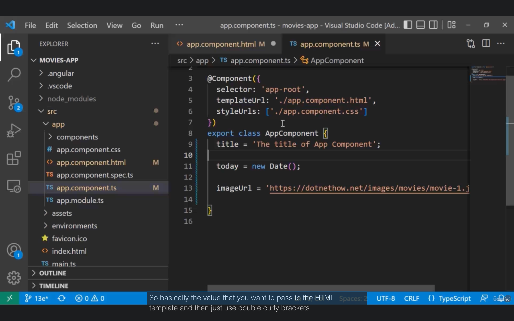
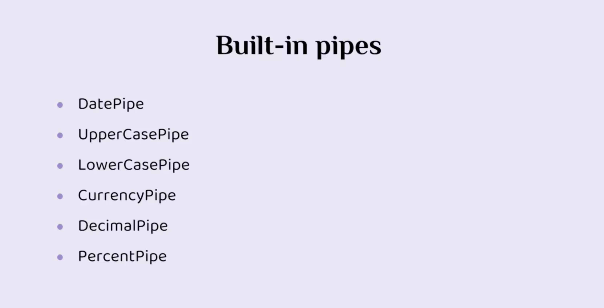
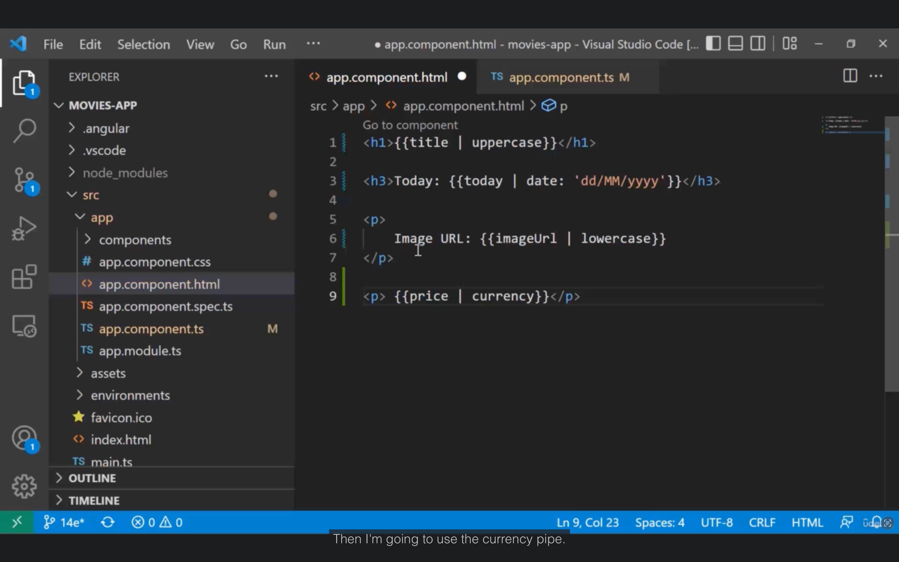
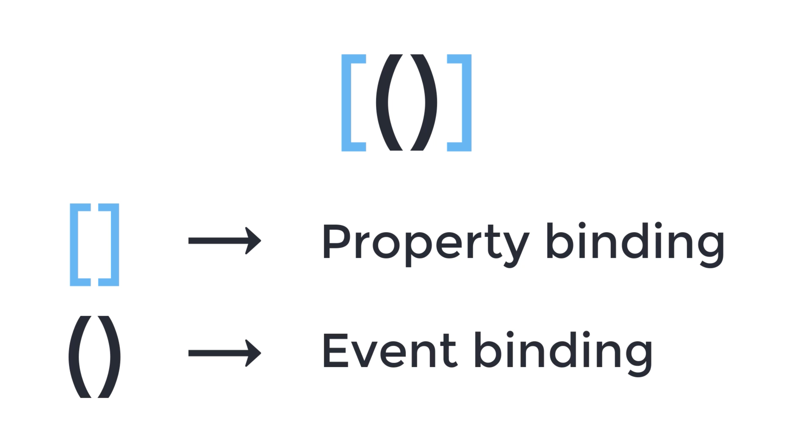
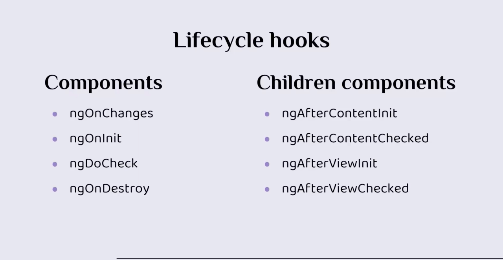

# Structure:

1. đầu tiên chúng ta có angular web.

- angular đầu tiên sử dụng **webpack** để gói mô-đun và xây dựng ứng dụng.

- **Webpack** là một công cụ mạnh mẽ giúp quản lý và gói tất cả các tài sản của ứng dụng, bao gồm Các tệp JavaScript, CSS và HTML.

- Nó tối ưu hóa mã và chuẩn bị cho việc triển khai.

2. **Babel-webpack**

- **Babel** là một trình biên dịch JavaScript cho phép các nhà phát triển viết mã JavaScript hiện đại và chuyển đổi nó thành các phiên bản tương thích ngược có thể chạy trong các trình duyệt cũ hơn.

- Nó thường được sử dụng cùng với các dự án Webpack và Angular để chuyển mã và đảm bảo trình duyệt chéo khả năng tương thích.

3. VS code:

- VS code là một trình chỉnh sửa mã nguồn và môi trường phát triển phổ biến. Mặc dù không liên quan trực tiếp đến cấu trúc thư mục góc cạnh, nhưng nó thường được các nhà phát triển sử dụng cho angular project.

- VS code cung cấp một loạt các tính năng và tiện ích mở rộng giúp nâng cao trải nghiệm phát triển, chẳng hạn như:

- Công cụ tô sáng cú pháp, hoàn thành mã và gỡ lỗi.

4. Node modul:

- Thư mục node mô-đun được tạo khi bạn cài đặt các phụ thuộc bên ngoài cho dự án góc của mình. Bằng cách sử dụng trình quản lý gói node npm. Nó chứa tất cả các gói và thư viện mà dự án của bạn yêu cầu. Các gói này được chỉ định trong tệp `package.json`.

- NodeJS sử dụng thư mục node mô-đun để định vị và tải các mô-đun cần thiết trong thời gian chạy.

5. file src nguồn.


- Đó là trung tâm của một angular project và chứa mã nguồn của ứng dụng.

- Nó thường bao gồm các thư mục con ứng dụng sau:

  - Thư mục con này chứa các thành phần chính, dịch vụ và các tệp cụ thể góc cạnh khác tạo nên Ứng dụng của bạn.

- Đó là nơi bạn sẽ viết hầu hết mã của mình.

- Các thành phần đại diện cho các phần khác nhau của giao diện người dùng, trong khi các dịch vụ xử lý logic kinh doanh và Thao tác dữ liệu.


6. asset:

- Vì vậy, thư mục con này được sử dụng để lưu trữ các tài sản tĩnh như hình ảnh, phông chữ hoặc các tệp khác được yêu cầu của mình.

- Các tài sản này có thể được tham chiếu và tải trong các thành phần(components) và mẫu(templates) của bạn.

7. enviroment:

- It contains environment specific configuration files such as environment dot products and environments which store variables used in different environments.
- Example production and deployment.
- You can specify different settings such as API endpoints or feature flags for each environment. There can be other custom folders that you may create based on your project's needs.

8. `Index.htmlI`.
- sixth thing we have is the `index.html` file, which is the main entry point of your angular application.
- It serves as the initial HTML document that gets loaded in the browser.
- You can include the necessary meta tags, script references and angular app root component selector in this file.
- The angular application is dynamically loaded into a designated HTML element within this file.

9. `main.ts`:

- là điểm khởi đầu của ứng dụng Angular của bạn.

- Nó chịu trách nhiệm khởi động mô-đun Angular và khởi tạo ứng dụng.

- Nó thường nhập mô-đun ứng dụng sẽ là mô-đun gốc của ứng dụng của bạn.

- Nó cũng gọi hàm bootstrap của nền tảng Angular để khởi động ứng dụng.

10. `Styles.css`:

- The `styles.css` file is the global stylesheet for your application Any styles defined in this file will be applied globally to your entire application.
- You can define custom CSS rules or override default styles that would be provided by angular or third party libraries. It basically allows you to define the overall look and feel of your application.

11. `Angular.json` file is the configuration file for your angular project.
- It contains various settings and options related to the building process, asset path, project structure,
and more.
- It's used to customize and fine tune your project's behavior.
- You can configure options in this file like build outputs, file replacements, and asset management.

12. `package.json`:
- the `package.json` file which is a crucial file in any Node.js project including angular projects.
- It's a file that lists all of the project's dependencies and their versions.
- It also includes scripts for running tasks such as building the application, running tests, or starting a development server.
- NPM, which stands for Node Package Manager, also uses this file to manage and install project dependencies.

13. `Tsconfig.json`.

- the TypeScript configuration files, such as `Tsconfig.json` that specify the compiler options and settings for the TypeScript compiler.
- They define how the TypeScript code is compiled into JavaScript, and allow for the customization of various compilation related features.
- You can configure target versions, module systems, and other options in these files.

14. `App.json` and `package.json`.

- I would like to clarify something here because it seems there might be some confusion. So in a typical angular project you won't have `App.json` or `RSpec` The Json files.
- These files are not a part of the default angular folder structure.
- However, it's possible that they become custom files that are specific to your project. Or maybe it's a typo in the names.

# Create new components:

1 số file làm vc cùng:

1. Component.TypeScript.(.ts) file.
- This contains the TypeScript code defining the components, behavior, properties, and methods.
- It interacts with the components, template and files to provide the desired functionality.

2. component.HTMLfile.
- This file contains the HTML markup that defines the structure and layout of the components view.
- It represents the visual elements and user interface of the component.

3. component.CSS. (.CSS file).
- This file contains the component specific styles and CSS rules that define the visual appearance of the component.
- In addition to these files, you will also have an app module file, typically named`App.module.ts`, that serves as the main entry point for your angular application.
- The app module imports and configures all the components, services, and modules required for your application to function correctly.


       ng g c name-component


# Interpolation:

- Data binding is a technique, where the data stays in sync between the component and the view

- When the data flows in one direction, we have one way data binding. So for example, from the view to the TypeScript class or from the TypeScript class to the view.
- When the data flows in both directions We have two way data binding and when the data is passed using an event such as a click event, then
we have event binding.

- Simples way of passing data from a typescript class to a view (one-way data binding)

- It allows you to display and update data in the template based on values stored in the component.

- In the components HTML template, we use interpolation by wrapping the property names in double curly brackets.`{{ }}`





# 

- Pipes transform strings, currency amounts, dates and other data for display





# Property Binding
- By using property binding, you can pass data in one direction way from a component to the template. But instead of just showing the data in the interpolation case, the property binding is used to set the value to property in an HTML element to bind to an element's property and close it in square brackets`[]`, which identifies the property as the target property.
- You can use property binding to set a value to an
HTML element property

# Event Binding

- To bind to an event. You use the angular event binding syntax.
In event binding, you need to define the event name in parentheses and the method name or the function that you want to call when the event is triggered.


      < button (click)="onClickCallThisFn()"> Click me </button >

# Two-way Binding
- Data flow is bi-directional, from typescript class to the template and vice-versa.
- The two way data binding passes data in a bidirectional way, which means that data is passed from a view to a component and from the component to a view at the same time.
- This way of binding data is really useful to build dynamic and interactive web applications.



# Modules:

- Module trong Angular (gọi là NgModule) là các khối đóng gói logic được dùng để gom nhóm các component liên quan lại với nhau. Chúng giúp tổ chức mã nguồn sạch sẽ, quản lý các phụ thuộc (dependencies) hiệu quả và hỗ trợ kỹ thuật Tải lười (Lazy-loading) để tối ưu hiệu năng ứng dụng

# Directives:

- `ngFor` (hoặc đầy đủ là *ngFor) là một Structural Directive trong Angular dùng để lặp qua một danh sách (mảng) dữ liệu và lặp lại cấu trúc của một phần tử HTML cho từng mục trong danh sách đó.


- `ngIf` (hay đầy đủ là *ngIf) kèm theo `else` là Structural Directive trong Angular dùng để kiểm tra điều kiện logic. Nếu điều kiện đúng (`true`), Angular sẽ hiển thị khối HTML hiện tại. Nếu điều kiện sai (false), Angular sẽ hiển thị một khối HTML thay thế được chỉ định qua từ khóa `else`.


- `ngSwitch` là một Attribute Directive trong Angular, hoạt động kết hợp với hai Structural Directives là `*ngSwitchCase` và `*ngSwitchDefault`. Cấu trúc này hoạt động hoàn toàn giống như câu lệnh switch-case trong các ngôn ngữ lập trình, giúp bạn hiển thị một khối HTML phù hợp nhất trong số nhiều lựa chọn dựa trên giá trị của một biểu thức.

- Cú pháp ngSwitch (Truyền thống)Để sử dụng cú pháp này, bạn cần đảm bảo đã import CommonModule (hoặc các directive cụ thể) vào component.Ví dụ thực tế: Hiển thị giao diện phân quyền dựa vào vai trò (role) của người dùng.

```<!-- Bọc thuộc tính [ngSwitch] quanh phần tử cha -->
<div [ngSwitch]="userRole">

  <!-- Hiển thị nếu userRole === 'admin' -->
  <div *ngSwitchCase="'admin'">
    <h3>Bảng điều khiển của Admin</h3>
    <button>Quản lý người dùng</button>
  </div>

  <!-- Hiển thị nếu userRole === 'editor' -->
  <div *ngSwitchCase="'editor'">
    <h3>Trình chỉnh sửa bài viết</h3>
    <button>Viết bài mới</button>
  </div>

  <!-- Hiển thị nếu userRole === 'member' -->
  <div *ngSwitchCase="'member'">
    <h3>Trang cá nhân thành viên</h3>
  </div>

  <!-- Khối mặc định hiển thị nếu không khớp với bất kỳ case nào ở trên -->
  <div *ngSwitchDefault>
    <h3>Vui lòng đăng nhập để xem nội dung</h3>
  </div>

</div>
```


# Routing:

## Basic:

- Angular Routing là cơ chế điều hướng cốt lõi giúp chuyển đổi qua lại giữa các view (giao diện) khác nhau trong ứng dụng trang đơn (Single Page Application - SPA). Nó cho phép thay đổi nội dung hiển thị trên URL mà không cần tải lại toàn bộ trang web, mang lại trải nghiệm mượt mà như ứng dụng máy tính.

🛠 Các bước thiết lập cơ bảnĐể xây dựng hệ thống định tuyến, bạn cần thực hiện theo các bước chuẩn cấu trúc của Angular Router:

1. Khai báo các RouteTạo danh sách các tuyến đường bằng cách ánh xạ mỗi URL (path) với một Component cụ thể.

```import { Routes } from '@angular/router';
import { HomeComponent } from './home/home.component';
import { AboutComponent } from './about/about.component';
import { PageNotFoundComponent } from './page-not-found/page-not-found.component';

export const routes: Routes = [
  { path: 'home', component: HomeComponent },
  { path: 'about', component: AboutComponent },
  { path: '', redirectTo: '/home', pathMatch: 'full' }, // Tự động chuyển hướng khi trang trống
  { path: '**', component: PageNotFoundComponent }      // Wildcard route cho lỗi 404
];
```

2. Hiển thị nội dung định tuyến:

Đặt thẻ giữ chỗ `<router-outlet>` vào file HTML chính (như **app.component.html**). Thành phần của route được chọn sẽ hiển thị ngay tại vị trí thẻ này.

```
<nav>
  <!-- Sử dụng routerLink thay cho href để tránh tải lại trang -->
  <a routerLink="/home" routerLinkActive="active">Trang chủ</a>
  <a routerLink="/about" routerLinkActive="active">Giới thiệu</a>
</nav>

<!-- Nơi nội dung của các component sẽ được nạp vào khi URL thay đổi -->
<router-outlet></router-outlet>
```

## Dynamic Routing:

- Dynamic Routing (Định tuyến động) trong Angular là kỹ thuật cấu hình các tuyến đường (routes) linh hoạt dựa trên dữ liệu thay đổi. Có hai khái niệm chính mà lập trình viên thường gọi là định tuyến động:
  - **Route Parameters (Định tuyến động theo tham số)**: Truyền dữ liệu biến đổi như id hoặc slug trực tiếp trên thanh URL để hiển thị chi tiết nội dung.
  - **Runtime Dynamic Routing (Nạp cấu hình Route từ API)**: Tự động thêm hoặc chỉnh sửa danh sách cấu hình Route sau khi ứng dụng đã khởi chạy (thường dùng cho hệ thống phân quyền/Decentralization).


1. Định tuyến động bằng Tham số (Route Parameters)Đây là cách phổ biến nhất để chuyển đổi dữ liệu hiển thị dựa trên URL.

Bước 1: Khai báo tham số trong cấu hình RouteSử dụng dấu hai chấm : trước tên biến trong thuộc tính path.

```
// app.routes.ts
import { Routes } from '@angular/router';
import { UserDetailComponent } from './user-detail/user-detail.component';

export const routes: Routes = [
  { path: 'user/:id', component: UserDetailComponent } // :id là tham số động
];
```

Bước 2: Lấy dữ liệu tham số trong Component:

Dùng dịch vụ `ActivatedRoute` để đọc giá trị từ URL. Bạn có thể lấy dữ liệu một lần bằng `snapshot` hoặc lắng nghe thay đổi liên tục bằng `paramMap`.

```
// user-detail.component.ts
import { Component, OnInit } from '@angular/core';
import { ActivatedRoute } from '@angular/router';

@Component({
  selector: 'app-user-detail',
  template: `<p>Đang xem thông tin cơ bản của User ID: {{ userId }}</p>`
})
export class UserDetailComponent implements OnInit {
  userId: string | null = '';

  constructor(private route: ActivatedRoute) {}

  ngOnInit() {
    // Cách 1: Sử dụng snapshot (Nếu component không bị tái sử dụng lại ngay sau đó)
    this.userId = this.route.snapshot.paramMap.get('id');

    // Cách 2: Sử dụng Observable (Khuyên dùng khi URL thay đổi liên tục giữa các ID)
    this.route.paramMap.subscribe(params => {
      this.userId = params.get('id');
      // Gọi API tải lại dữ liệu mới dựa trên userId tại đây
    });
  }
}
```
## Component interaction:

Trong Angular, việc tương tác và truyền dữ liệu giữa các thành phần (Component Interaction) là cốt lõi để xây dựng một ứng dụng động. Dựa trên cấu trúc phân cấp, Angular cung cấp các giải pháp chuyên biệt cho từng kịch bản cụ thể.

1. Truyền dữ liệu từ Cha xuống Con (@Input)

Đây là mô hình cơ bản nhất khi component cha muốn cấu hình hoặc truyền dữ liệu hiển thị cho component con.

- **Component con (child.component.ts)**: Khai báo thuộc tính nhận dữ liệu bằng `@Input()`.

```
import { Component, Input } from '@angular/core';

@Component({
  selector: 'app-child',
  template: `<p>Tin nhắn từ cha: {{ childMessage }}</p>`
})
export class ChildComponent {
  @Input() childMessage: string = '';
}
```


- `.Component cha (parent.component.ts)`: Truyền dữ liệu qua thuộc tính (Property Binding) ở file HTML.


```
<!-- parent.component.html -->
<app-child [childMessage]="parentMessage"></app-child>

// parent.component.ts
parentMessage = 'Chào con, đây là dữ liệu từ cha!';

```

2. Gửi sự kiện từ Con lên Cha (@Output & EventEmitter)

Sử dụng `EventEmitter`: Trong component 'About', bạn sẽ sử dụng `EventEmitter` và decorator `@Output` để phát đi một sự kiện khi người dùng thực hiện một hành động, chẳng hạn như nhấn nút gửi. Điều này sẽ cho phép bạn truyền dữ liệu

Khi component con có một hành động (như click nút) và cần thông báo hoặc gửi dữ liệu ngược lại cho cha

- `.Component con (child.component.ts)`: Định nghĩa một sự kiện đầu ra bằng @Output().


```
import { Component, Output, EventEmitter } from '@angular/core';

@Component({
  selector: 'app-child',
  template: `<button (click)="sendMessage()">Gửi lên cha</button>`
})
export class ChildComponent {
  @Output() messageEvent = new EventEmitter<string>();

  sendMessage() {
    this.messageEvent.emit('Con chào cha ạ!');
  }
}
```

- `.Component cha (parent.component.ts)`: Lắng nghe sự kiện (Event Binding) từ component con.

```
<!-- parent.component.html -->
<app-child (messageEvent)="receiveMessage($event)"></app-child>
<p>Nhận từ con: {{ messageFromChild }}</p>

// parent.component.ts
messageFromChild: string = '';

receiveMessage(event: string) {
  this.messageFromChild = event;}
```

3. Cha gọi trực tiếp phương thức của Con (@ViewChild)

Nếu component cha muốn chủ động kích hoạt một hàm hoặc đọc thuộc tính bên trong component con mà không cần chờ sự kiện

- .Component cha (parent.component.ts): Dùng @ViewChild để tham chiếu đến component con.


```
import { Component, ViewChild, AfterViewInit } from '@angular/core';
import { ChildComponent } from './child.component';

@Component({
  selector: 'app-parent',
  template: `
    <button (click)="triggerChildAction()">Kích hoạt con</button>
    <app-child></app-child>
  `
})
export class ParentComponent {
  // Tham chiếu trực tiếp đến selector ChildComponent
  @ViewChild(ChildComponent) child!: ChildComponent;

  triggerChildAction() {
    this.child.childMethod(); // Gọi trực tiếp hàm của con
  }
}
```

4. Tương tác giữa các Component bất kỳ (Shared Service)

Khi hai hoặc nhiều component nằm ở các nhánh khác nhau (không có quan hệ cha-con trực tiếp) cần đồng bộ dữ liệu liên tục, giải pháp tối ưu là sử dụng một Service trung gian kết hợp với RxJS **BehaviorSubject** hoặc **Signals** (từ Angular 16+)

- .Tạo Service trung gian (data.service.ts):

```
import { Injectable } from '@angular/core';
import { BehaviorSubject } from 'rxjs';

@Injectable({ providedIn: 'root' })
export class DataService {
  private messageSource = new BehaviorSubject<string>('Dữ liệu mặc định');
  currentMessage = this.messageSource.asObservable(); // Các component sẽ subscribe dòng này

  changeMessage(message: string) {
    this.messageSource.next(message); // Cập nhật dữ liệu mới
  }
}
```

- `.Component gửi dữ liệu`: Gọi hàm changeMessage().

- `.Component nhận dữ liệu`: Inject service vào constructor và `subscribe()` thuộc tính `currentMessage` để luôn nhận dữ liệu mới nhất khi có thay đổi

- `import`: Từ khóa này được sử dụng để nhập các module hoặc thành phần từ các tệp khác. Nó cho phép bạn sử dụng các thành phần hoặc chức năng bên ngoài trong mã của mình.
- `Component`: Đây là một decorator được sử dụng để xác định một component trong Angular. Component là các phần tử cơ bản tạo ra giao diện trong ứng dụng Angular. Mỗi component có thể có logic riêng và quản lý phần giao diện và hành vi của một phần giao diện người dùng.
- `EventEmitter`: Đây là một lớp được sử dụng để phát đi các sự kiện từ một component. Nó cho phép bạn gửi dữ liệu từ một component này sang một component khác, giúp kiểm soát và tương tác giữa chúng. EventEmitter rất hữu ích trong việc xử lý dữ liệu khi có sự kiện xảy ra (ví dụ: nút được nhấn).
- `@Output`: Đây là một decorator được sử dụng để chỉ định rằng một thuộc tính sẽ phát đi một sự kiện ra ngoài component. Nó cho phép các component con thông báo cho các component cha hoặc các component khác về các hành động hoặc thay đổi bên trong của chúng.

## Component life-cycle:

- A component in science has a lifecycle that starts when Angular initiates the component class and renders the component view along with its child views. And it ends when Angular destroys the component instance and removes its render template from the top.

- Lifecycle hooks are a special functionality in Angular that allow us to "hook into" and run code at a specific lifecycle event of a component or directive.

- Each interface defines a single hook method, whose name is the interface name prefixed with ng

      ngInterfaceName

     
      OnInit interface = ngOnInit


- Angular has eight important lifecycle hook interfaces which can be categorized based on the component
type.



- Angular Lifecycle Order:
1. ngOnChanges: 
   - Công dụng: Theo dõi sự thay đổi của các thuộc tính @Input.
   - Chi tiết: Nhận vào một đối tượng SimpleChanges chứa giá trị cũ và mới của biến truyền từ cha vào con.
   - Runs when input values change.
2. ngOnInit:
   - Công dụng: Khởi tạo dữ liệu cho component.
   - Chi tiết: Nơi lý tưởng để gọi API (HTTP requests) và thiết lập các biến ban đầu.
   - Runs once after the first data-bound properties are checked.

3. ngDoCheck: 
   - Công dụng: Tự tùy biến cơ chế kiểm tra thay đổi (Change Detection).
   - Chi tiết: Chạy liên tục để bắt các thay đổi mà Angular không tự nhận biết được (ví dụ: thay đổi sâu bên trong mảng hoặc object).
   - Runs during every change detection run.
4. ngAfterContentInit: 
   - Công dụng: Xử lý sau khi nội dung bên ngoài được nhúng vào. component. 
   - Chi tiết: Chạy một lần duy nhất sau khi nội dung nằm giữa cặp thẻ. `<ng-content>` được nạp xong.
   - Runs once after content is projected into the component.
5. ngAfterContentChecked: 
   - Công dụng: Kiểm tra lại nội dung được nhúng vào.
   - Chi tiết: Chạy sau mỗi lần hệ thống kiểm tra sự thay đổi của phần nội dung `<ng-content>`.
   - Runs after projected content is checked.
6. ngAfterViewInit: 
   - Công dụng: Thao tác với giao diện (DOM) của component và con của nó.
   - Chi tiết: Chạy một lần duy nhất khi toàn bộ giao diện đã dựng xong. Thường dùng để tích hợp các thư viện bên thứ ba cần can thiệp DOM.
   - Runs once after the component's view and child views are initialized.
7. ngAfterViewChecked: 
   - Công dụng: Kiểm tra lại giao diện sau khi cập nhật.
   - Chi tiết: Chạy sau mỗi lần hệ thống quét và cập nhật lại giao diện hiển thị của component.
   - Runs after the component's view and child views are checked.
8. ngOnDestroy: 
   - Công dụng: Dọn dẹp bộ nhớ trước khi component bị xóa khỏi màn hình.
   - Chi tiết: Hủy các kết nối (unsubscribe Observable), xóa bộ đếm thời gian (clearInterval) để tránh rò rỉ bộ nhớ (memory leak).
   - Runs just before Angular destroys the component.

# Snapshot:

`snapshot` thường được hiểu là **ActivatedRouteSnapshot**. Đây là một đối tượng tĩnh (ảnh chụp nhanh) cung cấp trạng thái hiện tại của một route tại thời điểm thành phần được tạo, bao gồm các tham số URL, query parameter và dữ liệu truyền vào.

Dưới đây là cách sử dụng và các khái niệm cốt lõi của snapshot:

1. Cách truy cập dữ liệu qua Snapshot

Bạn inject `ActivatedRoute` vào trong component và truy cập thuộc tính `.snapshot`

```import { Component, OnInit, inject } from '@angular/core';
import { ActivatedRoute } from '@angular/router';

@Component({
  selector: 'app-chi-tiet',
  template: `...`
})
export class ChiTietComponent implements OnInit {
  private route = inject(ActivatedRoute);

  ngOnInit() {
    // 1. Lấy Route Parameter (ví dụ: /chi-tiet/:id)
    const id = this.route.snapshot.paramMap.get('id');

    // 2. Lấy Query Parameter (ví dụ: /chi-tiet?search= angular)
    const search = this.route.snapshot.queryParamMap.get('search');
    
    // 3. Lấy Data được truyền trực tiếp qua route (ví dụ: title)
    const title = this.route.snapshot.data['title'];
  }
}
```

2. Sự khác biệt: Snapshot vs Observable

- Snapshot (.snapshot): Lấy giá trị một lần duy nhất tại thời điểm component khởi tạo.
- Observable (ví dụ: .paramMap.subscribe()): Lắng nghe liên tục. Nếu người dùng thay đổi tham số (ví dụ: bấm một nút link sang một ID khác nhưng dùng chung một component), dữ liệu sẽ tự động cập nhật mà không cần load lại trang.

3. Khi nào nên dùng Snapshot?
- Sử dụng snapshot khi bạn biết chắc chắn rằng component sẽ luôn bị huỷ và khởi tạo lại mỗi khi người dùng thay đổi đường dẫn hoặc tham số trên URL.
- Nó giúp code ngắn gọn, dễ đọc, không cần phải quản lý việc hủy đăng ký (unsubscribe).

4. Hạn chế
- Nếu component vẫn đang hiển thị trên màn hình (không bị hủy) và URL chỉ thay đổi phần queryParams, snapshot sẽ không tự cập nhật. Trong trường hợp đó, bạn bắt buộc phải dùng Observable.


# RxJS:

1. RxJS, viết tắt của **Reactive Extensions for JavaScript**, là một thư viện mạnh mẽ để xử lý lập trình bất đồng bộ trong các ứng dụng JavaScript, đặc biệt là trong Angular. Dưới đây là giải thích đơn giản về các thành phần chính của nó:
- `Observables`: Cốt lõi của RxJS là các observables, đại diện cho các luồng dữ liệu có thể được quan sát theo thời gian. Các luồng này có thể phát ra giá trị tại bất kỳ thời điểm nào, cho phép các nhà phát triển phản ứng với dữ liệu thay đổi.
- `Operators`: RxJS bao gồm nhiều toán tử cho phép các nhà phát triển thao tác và chuyển đổi các luồng dữ liệu một cách hiệu quả. Ví dụ, các toán tử như map, filter và mergeMap cho phép bạn sửa đổi dữ liệu và quản lý cách dữ liệu chảy qua ứng dụng của bạn.
- `Subscriptions`: Để sử dụng một observable, bạn cần đăng ký nó. Đăng ký là một cách để thực thi observable và nhận thông báo bất cứ khi nào nó phát ra giá trị mới hoặc gặp lỗi.
- `Event Handling`: RxJS tạo điều kiện thuận lợi cho việc xử lý sự kiện trong các ứng dụng Angular bằng cách cho phép tạo các luồng observable từ các tương tác của người dùng (như nhấp chuột hoặc nhấn phím). Điều này giúp cập nhật giao diện người dùng một cách linh hoạt để phản hồi các sự kiện này.

- `Lập trình phản ứng`: Nhìn chung, RxJS thúc đẩy mô hình lập trình phản ứng, giúp các nhà phát triển dễ dàng tạo ra các ứng dụng phản hồi với dữ liệu thay đổi theo thời gian.

Bằng cách tận dụng các tính năng này, các nhà phát triển có thể xây dựng các ứng dụng phản hồi nhanh và hiệu quả hơn, biến RxJS trở thành một công cụ có giá trị trong phát triển Angular.

Nội dung này có liên quan đến bạn không?

2. Sử dụng RxJS trong các ứng dụng Angular mang lại một số lợi ích quan trọng:

- `Xử lý các thao tác bất đồng bộ`: Các ứng dụng Angular thường yêu cầu lấy dữ liệu từ máy chủ, liên quan đến các tác vụ bất đồng bộ. RxJS đơn giản hóa quá trình này bằng cách cung cấp các công cụ như observable để xử lý các thao tác này một cách nhất quán và dễ quản lý, dẫn đến mã sạch hơn và dễ bảo trì hơn.

- `Xử lý sự kiện và cập nhật giao diện người dùng`: Các ứng dụng web tương tác cần phản hồi các sự kiện của người dùng như nhấp chuột hoặc di chuyển chuột. RxJS cho phép các nhà phát triển tạo luồng observable từ các sự kiện này, cho phép cập nhật giao diện người dùng động để phản hồi các tương tác của người dùng.
- `Chuyển đổi và thao tác dữ liệu`: RxJS cung cấp nhiều toán tử giúp chuyển đổi và thao tác dữ liệu trong các observable. Ví dụ, các toán tử như map, filter và mergeMap giúp sửa đổi luồng dữ liệu và áp dụng logic điều kiện, giúp xử lý dữ liệu hiệu quả và ngắn gọn.

- `Mô hình lập trình phản ứng`: Bằng cách sử dụng RxJS, các nhà phát triển có thể áp dụng mô hình lập trình phản ứng, giúp tăng cường khả năng phản hồi của ứng dụng đối với các thay đổi dữ liệu theo thời gian, cuối cùng dẫn đến trải nghiệm người dùng hấp dẫn hơn.

Tóm lại, RxJS giúp các nhà phát triển tạo ra các ứng dụng Angular phản hồi nhanh hơn, hiệu quả hơn và dễ quản lý hơn bằng cách xử lý hiệu quả các hoạt động bất đồng bộ, quản lý sự kiện và chuyển đổi luồng dữ liệu.


## Promises:

1. Promise trong JavaScript là một cách để xử lý các thao tác bất đồng bộ và đại diện cho một giá trị có thể có sẵn ngay bây giờ, trong tương lai hoặc không bao giờ. Dưới đây là một phân tích đơn giản về các khái niệm chính của nó:

- Trạng thái: Một Promise có thể ở một trong ba trạng thái:

  - Đang chờ: Trạng thái ban đầu, nghĩa là Promise vẫn đang chờ kết quả.

  - Đã hoàn thành: Thao tác đã hoàn thành thành công, dẫn đến một giá trị đã được giải quyết.

  - Bị từ chối: Thao tác đã thất bại, dẫn đến một lỗi.

2. Sử dụng Promises:

- Khi một Promise được tạo, nó nhận một hàm (executor) chứa hai hàm: `resolve` và `reject`. Hàm `resolve` được gọi khi thao tác thành công, trong khi `reject` được gọi khi có lỗi.

- Bạn có thể xử lý kết quả của một Promise bằng cách sử dụng phương thức `.then()` cho các giá trị đã được giải quyết và `.catch()` cho các lỗi.

Ví dụ:

- Nếu bạn đang thực hiện một yêu cầu HTTP, bạn có thể tạo một Promise để cố gắng lấy dữ liệu. Nếu dữ liệu được lấy thành công, Promise sẽ được giải quyết. Nếu có lỗi (như sự cố mạng), Promise sẽ bị từ chối.

- Xử lý lỗi: Phương thức. `catch()` cho phép bạn xử lý lỗi một cách khéo léo khi một Promise bị từ chối, đảm bảo ứng dụng của bạn có thể phản hồi các lỗi một cách thích hợp.

## Observables:

1. Observable là một khái niệm cốt lõi trong RxJS và đóng vai trò quan trọng trong lập trình phản ứng. 
- Định nghĩa: Observable là một cấu trúc lập trình cho phép bạn quản lý các luồng dữ liệu bất đồng bộ. Nó cung cấp một cách để quan sát các thay đổi trong dữ liệu theo thời gian, cho phép các nhà phát triển phản ứng với những thay đổi đó một cách linh hoạt.

- Luồng dữ liệu: Observable có thể phát ra nhiều giá trị theo thời gian, đại diện cho một luồng dữ liệu liên tục. Điều này đặc biệt hữu ích để xử lý các sự kiện như tương tác người dùng, yêu cầu HTTP hoặc bộ hẹn giờ.

- Mẫu Observer: Observable hoạt động dựa trên mẫu Observer, trong đó một hoặc nhiều observer đăng ký vào một observable để nhận thông báo khi dữ liệu mới được phát ra. Mỗi observer sẽ được thông báo bất cứ khi nào có sự thay đổi, cho phép cập nhật theo thời gian thực trong các ứng dụng.

- Các chức năng chính:

   - **Next**: Được sử dụng để gửi dữ liệu đến các observer.

   - **Error**: Thông báo cho các observer nếu xảy ra lỗi. trong quá trình truyền dữ liệu.

   - **Complete**: Cho biết observable đã hoàn thành việc gửi dữ liệu.

   - **Cách sử dụng**: Observables đặc biệt hữu ích trong các ứng dụng Angular để quản lý luồng dữ liệu, giúp dễ dàng xử lý các thao tác bất đồng bộ và cải thiện khả năng phản hồi của ứng dụng.

Tóm lại, observables đóng vai trò là một công cụ mạnh mẽ trong lập trình phản ứng, cho phép quan sát và quản lý liền mạch các luồng dữ liệu và sự kiện một cách linh hoạt và hiệu quả..

## Operators:

1. Toán tử `map` trong RxJS (dùng bên trong hàm `.pipe()`) là một toán tử biến đổi dữ liệu (Transformation Operator). Nó có cách hoạt động tương tự như hàm `.map()` của mảng trong JavaScript, nhưng áp dụng cho một luồng dữ liệu theo thời gian.Khi một giá trị được phát ra từ nguồn (Observable), toán tử `map` sẽ bắt lấy giá trị đó, áp dụng một hàm biến đổi do bạn định nghĩa, rồi phát kết quả mới xuống cho người đăng ký (`subscribe`)

```
import { map } from 'rxjs/operators';

observableNguon.pipe(
  map(giaTriGoc => giaTriMoi)
).subscribe(data => console.log(data));
```

2. Toán tử `filter` trong RxJS (được sử dụng bên trong hàm `.pipe()`) là một toán tử lọc dữ liệu (Filtering Operator). Nó hoạt động dựa trên một điều kiện do bạn đưa ra (hàm điều kiện trả về `true` hoặc `false`).

- Nếu điều kiện là `true`: Dữ liệu được phép đi qua và truyền tiếp xuống cho người đăng ký (subscribe).
- Nếu điều kiện là `false`: Dữ liệu bị chặn lại ngay lập tức và không phát ra ngoài.


```
import { filter } from 'rxjs/operators';

observableNguon.pipe(
  filter(giaTri => dieuKienThoaMan)
).subscribe(data => console.log(data));
```
## Subject:

Trong RxJS, Subject là một loại Observable đặc biệt. Điểm độc đáo của nó là vừa đóng vai trò là một Observable (để truyền dữ liệu cho người khác nghe), vừa đóng vai trò là một Observer (có thể tự phát ra dữ liệu mới bằng hàm `.next()`).

Nếu một Observable thông thường giống như một kênh xem phim Netflix (mỗi người bấm xem sẽ xem từ đầu, độc lập nhau), thì Subject giống như một rạp chiếu phim ngoài đời hoặc một buổi Livestream (ai vào muộn sẽ chỉ xem được đoạn đang phát, mọi người cùng xem chung một nội dung tại một thời điểm).

1. Đặc điểm cốt lõi của Subject
- **Tính chất Multicast (Phát đa hướng)**: Một Subject có thể chia sẻ cùng một luồng dữ liệu cho nhiều người đăng ký (subscribe) cùng lúc. Khi Subject phát ra dữ liệu, tất cả người nghe đều nhận được giá trị giống nhau.
- **Có khả năng chủ động phát dữ liệu**: Bạn có thể gọi `subject.next(gia_tri)` ở bất kỳ đâu trong code để đẩy một dữ liệu mới vào luồng.
- **Không lưu lại lịch sử (đối với Subject cơ bản)**: Những ai `subscribe` sau khi dữ liệu đã phát sẽ không nhận được các giá trị cũ trước đó.

2. Cách dùng cơ bản:
```
import { Subject } from 'rxjs';

// 1. Khởi tạo một Subject
const mySubject = new Subject<number>();

// 2. Người nghe thứ nhất đăng ký
mySubject.subscribe(val => console.log('Người nghe A:', val));

// 3. Chủ động phát dữ liệu
mySubject.next(1); // Cả A nhận được: 1
mySubject.next(2); // Cả A nhận được: 2

// 4. Người nghe thứ hai đăng ký vào muộn
mySubject.subscribe(val => console.log('Người nghe B:', val));

// 5. Phát tiếp dữ liệu
mySubject.next(3); 
// Kết quả in ra:
// Người nghe A: 3
// Người nghe B: 3 (B vào muộn nên KHÔNG nhận được số 1 và 2)
```

3. Bốn loại Subject phổ biến trong RxJS:

Tùy vào nhu cầu lưu trữ và phát lại dữ liệu, RxJS chia Subject thành 4 loại chính:

-  Standard Subject (Subject)
   - Đặc điểm: Không có giá trị khởi tạo, không giữ lại giá trị cũ. Ai vào sau thì ráng chịu.
   - Ứng dụng: Thường dùng để bắt các sự kiện click, thông báo hành động (ví dụ: nút "Đăng xuất" được bấm).
   
-  BehaviorSubject (Dùng nhiều nhất trong Angular)
   -  Đặc điểm: Bắt buộc có một giá trị khởi tạo. Nó luôn luôn ghi nhớ giá trị mới nhất vừa phát. Bất kỳ ai subscribe vào nó (dù muộn đến đâu) cũng sẽ lập tức nhận được giá trị mới nhất đó ngay khi vừa đăng ký.
   - Ứng dụng: Làm State Management (quản lý trạng thái), lưu thông tin User đăng nhập, lưu trạng thái bật/tắt của giao diện (Dark/Light mode).
   
- ReplaySubject
  - Đặc điểm: Có khả năng ghi nhớ một số lượng cấu hình trước các giá trị cũ (ví dụ: nhớ 3 giá trị gần nhất). Khi có người mới subscribe, nó sẽ "tua lại" toàn bộ số giá trị đó cho người mới nghe.
  - Ứng dụng: Lưu lại lịch sử thao tác của người dùng, hoặc lưu bộ nhớ đệm (cache) dữ liệu.

- AsyncSubject
  - Đặc điểm: Chỉ phát ra duy nhất giá trị cuối cùng của luồng dữ liệu, và chỉ phát khi luồng đó đã gọi hàm .complete().
  - Ứng dụng: Dùng cho các tác vụ tính toán lớn, chỉ cần lấy kết quả chung cuộc khi mọi thứ đã xong xuôi.


In RxJS, a BehaviorSubject is a special type of subject that retains the last emitted value and emits it immediately to new subscribers. Here are some key features and use cases for BehaviorSubject:
- Initial Value: BehaviorSubject requires an initial value when you create it. This value will be emitted immediately to any new subscribers, making it useful for scenarios where you want to provide a default state.
- State Management: Because it holds onto the latest value, BehaviorSubject is often used for state management in Angular applications. It ensures that any component or service can get the most recent state at any time.
- Multicasting: Like other subjects, BehaviorSubject multicasts to multiple subscribers. When a value is emitted from the BehaviorSubject using .next(value), all currently subscribed observers will receive the new value.
- Inter-Component Communication: BehaviorSubjects enable components to communicate directly. A component can update the BehaviorSubject, and any other component subscribing to it will receive the update immediately.
- Use Cases: Common use cases include maintaining user session states, managing form data, providing real-time updates to multiple parts of an application, and handling shared data.

By utilizing BehaviorSubjects, you can create more responsive and interactive applications that efficiently manage the state and communication between components.
